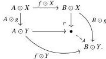

8

E. Cavallo and C. Sattler

$f: A \rightarrow B$ and $g: X \rightarrow Y$ as the following induced map:

**Example 2.4** If $\mathbf{E}$ is a category with binary products and pushouts, applying the Leibniz construction to the binary product functor $\times: \mathbf{E} \times \mathbf{E} \rightarrow \mathbf{E}$ produces the *pushout product* bifunctor $\bar{\times}: \mathbf{E}^{\rightarrow} \times \mathbf{E}^{\rightarrow} \rightarrow \mathbf{E}^{\rightarrow}$.

## 2.2 Model structures and Quillen equivalences

In the abstract, the force of our result is that a certain model category presents the $(\infty, 1)$-category of $\infty$-groupoids. Concretely, we work entirely in model-categorical terms, exhibiting a Quillen equivalence between this model category and another model category—simplicial sets—already known to present $\infty$-**Gpd**. We briefly fix the relevant basic definitions here but assume prior familiarity, especially with factorization systems; standard references include [Hov99; DHKS04].

**Definition 2.5** A *model structure* on a category $\mathbf{M}$ is a triple $(\mathcal{C}, \mathcal{W}, \mathcal{F})$ of classes of morphisms in $\mathbf{M}$, called the *cofibrations*, *weak equivalences*, and *fibrations* respectively, such that $(\mathcal{C}, \mathcal{F} \cap \mathcal{W})$ and $(\mathcal{C} \cap \mathcal{W}, \mathcal{F})$ are weak factorization systems and $\mathcal{W}$ satisfies the 2-out-of-3 property. A *model category* is a finitely complete and cocomplete category equipped with a model structure. We use the arrow $\mapsto$ for cofibrations, $\Rightarrow$ for weak equivalences, and $\rightarrow$ for fibrations. Maps in $\mathcal{C} \cap \mathcal{W}$ and $\mathcal{F} \cap \mathcal{W}$ are called *trivial* cofibrations and fibrations respectively.

We say that a model structure on $\mathbf{M}$ *has monos as cofibrations* when its class of cofibrations is exactly the class of monomorphisms in $\mathbf{M}$.$^4$

**Definition 2.6** We say an object is *cofibrant* when $0 \rightarrow A$ is a cofibration, dually *fibrant* if $A \rightarrow 1$ is a fibration. The weak factorization system $(\mathcal{C}, \mathcal{F} \cap \mathcal{W})$ implies that for every object $A$, we have a diagram $0 \mapsto A^{\text{cof}} \Rightarrow A$ obtained by factorizing $0 \rightarrow A$; we say such an $A^{\text{cof}}$ is a *cofibrant replacement* of $A$. Likewise, an object $A^{\text{fib}}$ sitting in a diagram $A \mapsto A^{\text{fib}} \rightarrow 1$ is a *fibrant replacement* of $A$.

**Definition 2.7** We say an object $X$ in a model category is *weakly contractible* when the map $X \rightarrow 1$ is a weak equivalence.

$^4$Such a model structure which is also cofibrantly generated (see below) is called a *Cisinski model structure*, these being the subject of [Cis06].

2025/10/16 00:43