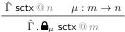
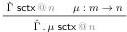
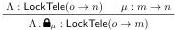

arXiv:2406.13622v1 [cs.LO] 19 Jun 2024

# A Sound and Complete Substitution Algorithm for Multimode Type Theory: Technical Report

Joris Ceulemans \( ^{1} \)

DistriNet, KU Leuven, Belgium

Andreas Nuyts \( ^{2} \)

DistriNet, KU Leuven, Belgium

Dominique Devriese

DistriNet, KU Leuven, Belgium

## 1 Introduction

This is the technical report accompanying the paper “A Sound and Complete Substitution Algorithm for Multimode Type Theory” [1]. It contains a full definition of WSMTT in Section 2, including many rules for  \( \sigma \) -equivalence and a description of all rules that have been omitted. Furthermore, we present completeness and soundness proofs of the substitution algorithm in full detail. These can be found in Sections 4 and 5 respectively. In order to make this document relatively self-contained, we also include a description of SFMTT in Section 3.

## 2 WSMTT: Full Description & σ-equivalence

### 2.1 Extrinsically typed syntax

The definition of scoping contexts and lock telescopes is repeated in Figure 1. All WSMTT expression and substitution constructors that were already covered by the paper are included in Figure 2. The other WSMTT constructors for expressions can be found in Figure 3; the description of WSMTT substitutions was already complete in the paper.

The extra constructors for WSMTT expressions include a type of booleans (WSMTT-EXPR-BOOL) with corresponding constructors (WSMTT-EXPR-TRUE and WSMTT-EXPR-FALSE) and dependent eliminator (WSMTT-EXPR-IF). We see that when applying a (dependent)  \( \mu \) -modal function to an expression t, that argument expression t must be well-scoped in the locked

\( ^{1} \)  Joris Ceulemans held a PhD fellowship (1184122N) of the Research Foundation – Flanders (FWO) while working on this research. This research is partially funded by the Research Fund KU Leuven and by the Research Foundation - Flanders (FWO; G030320N).
\( ^{2} \)  Andreas nuyts holds a Postdoctoral fellowship (1247922N) of the Research Foundation – Flanders (FWO).

SCTX-EMPTY

· sctx @ m

SCTX-LOCK

SCTX-EXTEND

LOCKTELE-EMPTY

· : LockTele(m → m)

locks (·) = 1

LOCKTELE-LOCK

locks \((\Lambda : \widehat{\mathbf{a}}_{\mu}) = \text{locks}(\Lambda) \circ \mu\)

Figure 1 Definition of scoping contexts and lock telescopes. This figure is identical to Figure 3 in the paper.