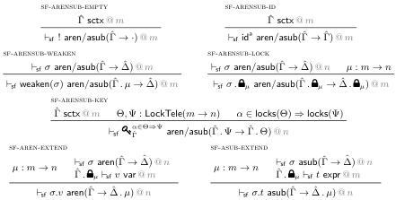
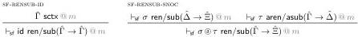

J. Ceulemans, A. Nuyts and D. Devriese

7

Figure 7 Definition of atomic SFMTT renamings and substitutions (identical to Figure 8 in the paper)

Figure 8 Definition of regular SFMTT renamings and substitutions (identical to Figure 9 in the paper)

expressions can be found in Figure 6. Note that all SFMTT constructors except SF-EXPR-VAR have a counterpart in WSMTT. Conversely, all WSMTT constructors except WSMTT-EXPR-VAR and WSMTT-EXPR-SUB have a counterpart in SFMTT. Atomic and regular SFMTT rensubs are defined in Figures 7 and 8.

We also recall some of the defined operations for atomic and regular SFMTT rensubs. First of all, there is a weakening atomic rensub

$$
\pi := \text{weaken}(\mathrm{id}^a) \tag{2}
$$

from $\hat{\Gamma} \cdot \mu$ to $\hat{\Gamma}$ for any scoping context $\hat{\Gamma}$ and modality $\mu$. Furthermore, given an atomic rensub $\sigma$ from $\hat{\Gamma}$ to $\hat{\Delta}$, we can construct a new, lifted atomic rensub

$$
\sigma^+ := \text{weaken}(\sigma) \cdot \mathbf{v}_0^{1_\mu} \tag{3}
$$

from $\hat{\Gamma} \cdot \mu$ to $\hat{\Delta} \cdot \mu$ (here $\mathbf{v}_0^{1_\mu}$ is interpreted as a variable in the case of renamings and as an expression in the case of substitutions). Finally, the lift and lock operations can be extended to regular rensubs by applying those operations to all constituent atomic rensubs. In other words, we have

$$
\begin{array}{l}
\mathrm{id}^+ := \mathrm{id} \\
(\sigma \circledast \tau)^+ := \sigma^+ \circledast \tau^+ \\
\mathrm{id} \cdot \widehat{\boldsymbol{\Omega}}_\mu := \mathrm{id} \\
(\sigma \circledast \tau) \cdot \widehat{\boldsymbol{\Omega}}_\mu := (\sigma \cdot \widehat{\boldsymbol{\Omega}}_\mu) \circledast (\tau \cdot \widehat{\boldsymbol{\Omega}}_\mu).
\end{array}
$$