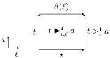
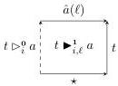
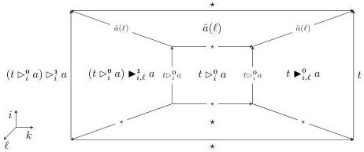

28:14

M. DORÉ, E. CAVALLO, AND A. MÖRTBERG

Vol. 22:2

by

\[
t \blacktriangleright_ {i, \ell} ^ {e} a := \mathsf {f i l l} ^ {\overline {{e}} \rightarrow \ell} j. [ i = \mathbf {0} \mapsto \star | i = \mathbf {1} \mapsto \hat {a} (j) ] t
\]

\[
t \triangleright_ {i} ^ {e} a := t \blacktriangleright_ {i, e} ^ {e} a
\]

as pictured below.

Definition 3.13. Let \(\langle X|R\rangle\) be a finite presentation of a group. For each word \(w\) on \(X\), define a cell \(\lceil X|R\rceil \mid i\vdash \lceil w\rceil (i):[\partial i\mapsto \star ]\) by recursion on \(w\) as follows.

\[
\lceil \epsilon \rceil (i) = \star
\]

\[
\lceil w a \rceil (i) = \lceil w \rceil (i) \triangleright_ {i} ^ {1} a
\]

\[
\lceil w a ^ {- 1} \rceil (i) = \lceil w \rceil (i) \triangleright_ {i} ^ {0} a
\]

Now we show that when two words represent the same element of the presented group, their encodings as paths are related by a 2-cell. First, we prove a lemma corresponding to cancellation of inverses.

Definition 3.14. Let \(\langle X|R\rangle\) be a convenient presentation of a group, \(a\in X\) be a generator, and \(\lceil X|R\rceil \mid i\vdash t:[\partial i\mapsto \star ]\) be a cell. For \(e\in \{\mathbf{0},\mathbf{1}\}\), define the cell

\[
\lceil X | R \rceil \mid i, k \vdash \operatorname{cancel} _ {i, k} ^ {e} (t, a): [ \partial i \mapsto \star \mid k = \mathbf {0} \mapsto (t \triangleright_ {i} ^ {e} a) \triangleright_ {i} ^ {\overline {{e}}} a \mid k = \mathbf {1} \mapsto t ]
\]

as follows.

\[
\mathsf {c a n c e l} _ {i, k} ^ {e} (t, a) := \mathsf {f i l l} ^ {e \to \overline {{e}}}   \ell . \left[ \begin{array}{l} i = \mathbf {0} \mapsto \star \\ i = \mathbf {1} \mapsto \hat {a} (\ell) \\ k = \mathbf {0} \mapsto (t \triangleright_ {i} ^ {e} a)   \blacktriangleright_ {i, \ell} ^ {\overline {{e}}} a \\ k = \mathbf {1} \mapsto t   \blacktriangleright_ {i, \ell} ^ {e} a \end{array} \right]    (t \triangleright_ {i} ^ {e} a)
\]

In the case e = 0, this is the front face of the filler for the open cube pictured below.

Next we construct cells corresponding to the equations in \( R \). For this we will make use of the following auxiliary construction.