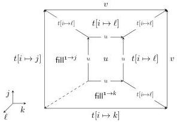

Vol. 22:2

AUTOMATING BOUNDARY FILLING IN CUBICAL TYPE THEORIES

28:15

Definition 3.15 (Pseudo-∨). Given a cell Γ | i ⊢ t : [i = 0 ↦ u | i = 1 ↦ v], define the cell

$$\Gamma \mid j, k \vdash \mathsf{cnx}_{\vee}(i.t)(j, k) : \left[ \begin{array}{l l} j = \mathbf{0} \mapsto t[i \mapsto k] & j = \mathbf{1} \mapsto v \\ k = \mathbf{0} \mapsto t[i \mapsto j] & k = \mathbf{1} \mapsto v \end{array} \right]$$

to be

$$\mathsf{fill}^{\mathbf{0} \to \mathbf{1}} \ell. \left[ \begin{array}{l} j = \mathbf{0} \mapsto \mathsf{fill}^{1 \to k} \ m. \ [\ell = \mathbf{0} \mapsto u \mid \ell = \mathbf{1} \mapsto t[i \mapsto m]] \ t[i \mapsto \ell] \\ k = \mathbf{0} \mapsto \mathsf{fill}^{1 \to j} \ m. \ [\ell = \mathbf{0} \mapsto u \mid \ell = \mathbf{1} \mapsto t[i \mapsto m]] \ t[i \mapsto \ell] \\ j = \mathbf{1} \mapsto t[i \mapsto \ell] \\ k = \mathbf{1} \mapsto t[i \mapsto \ell] \end{array} \right] \ u$$

which is the front face of the filler for the open cube pictured below.

Note that if we are working relative to the disjunctive, Dedekind, or De Morgan contortion theory, then there is a much simpler construction of a cell with the same boundary when t is a contorted cell, namely cnx∨(i.t)(j, k) := t⟨i ↦ j ∨ k⟩ (cf. (2.4)).

Definition 3.16. Let ⟨X|R⟩ be a convenient presentation of a group, abc⁻¹ = 1 be an equation in R, and ⌈X|R⌉ | i ⊢ t : [∂i ↦ ⋆] be a cell. Define the cell

$$\ulcorner X|R\urcorner \mid i, k \vdash \mathsf{rew}_{i,k}^{a,b,c}(t) : [\partial i \mapsto \star \mid k = \mathbf{0} \mapsto (t \triangleright_i^1 a) \triangleright_i^1 b \mid k = \mathbf{1} \mapsto t \triangleright_i^1 c]$$

to be

$$\mathsf{fill}^{\mathbf{0} \to \mathbf{1}} \ j. \left[ \begin{array}{l} i = \mathbf{0} \mapsto \star \\ i = \mathbf{1} \mapsto \mathsf{cnx}_{\vee}(i.\hat{b}(i))(j, k) \\ k = \mathbf{0} \mapsto (t \triangleright_i^1 a) \blacktriangleright_{i,j}^1 b \\ k = \mathbf{1} \mapsto t \triangleright_i^1 c \end{array} \right] \left( \mathsf{fill}^{\mathbf{0} \to \mathbf{1}} \ j. \left[ \begin{array}{l} i = \mathbf{0} \mapsto \star \\ i = \mathbf{1} \mapsto s_{a,b,c}(j, k) \\ k = \mathbf{0} \mapsto t \blacktriangleright_{i,j}^1 a \\ k = \mathbf{1} \mapsto t \blacktriangleright_{i,j}^1 c \end{array} \right] \ t \right)$$

which is the iterated composite pictured below.