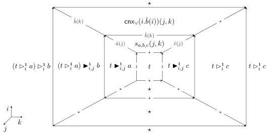

28:16

M. DORÉ, E. CAVALLO, AND A. MÖRTBERG

Vol. 22:2

Combining the previous constructions, we can obtain a cell from any equation in the presented group.

Proposition 3.17. Let \(\langle X|R\rangle\) be a convenient presentation of a group \(G\). For any pair of words \(v,w\) on \(X\) such that \(v\equiv_G w\), there exists a cell

\[
{ } ^ { \intercal } X | R ^ { \intercal } \mid i , k \vdash t _ { v , w } : [ \partial i \mapsto \star \mid k = 0 \mapsto { } ^ { \intercal } v ^ { \intercal } ( i ) \mid k = 1 \mapsto { } ^ { \intercal } w ^ { \intercal } ( i ) ] \tag {3.1}
\]

Proof. The relation  \( \equiv_{G} \)  on words on X is generated by the clauses

(1) \( wab \equiv_G wc \) whenever \( abc^{-1} = 1 \) is an equation in \( R \).
(2) \(waa^{-1} \equiv_G w\) and \(wa^{-1}a \equiv_G w\) for a word \(w\) and \(a \in X\);
(3) \(va \equiv_G wa\) and \(va^{-1} \equiv_G wa^{-1}\) for all words \(v, w\) with \(v \equiv_G w\) and \(a \in X\).
(4) \(w \equiv_G w\) for all words \(w\);
(5) \(w \equiv_G v\) for all words \(v, w\) with \(v \equiv_G w\);
(6) \(u \equiv_G w\) for all words \(u, v, w\) with \(u \equiv_G v\) and \(v \equiv_G w\).

It thus suffices to show that we have operations on cells of the form (3.1) corresponding to each clause. Clause (1) is covered by Definition 3.16 and (2) is covered by Definition 3.14. Clause (3) corresponds to applying \((-)\triangleright_{i}^{1}a\) or \((-)\triangleright_{i}^{0}a\). Clauses (4), (5), and (6) correspond to reflexivity, symmetry, and transitivity of 2-dimensional paths respectively. For the latter two, given \(t_{u,v}\) and \(t_{v,w}\) as in (3.1), we have

\[
t _ {w, v} := \mathsf {f i l l} ^ {\mathsf {0} \to \mathsf {1}} j. \left[ \begin{array}{l} \partial i \mapsto \star \\ k = \mathsf {0} \mapsto t _ {v, w} [ k \mapsto j ] \\ k = \mathsf {1} \mapsto \lceil v \rceil (i) \end{array} \right] \lceil v \rceil (i)
\]

and

\[
t _ {u, w} := \mathsf {f i l l} ^ {\mathsf {0} \to \mathsf {1}} j. \left[ \begin{array}{l} \partial i \mapsto \star \\ k = \mathsf {0} \mapsto \lceil u \rceil (i) \\ k = \mathsf {1} \mapsto t _ {v, w} [ k \mapsto j ] \end{array} \right] t _ {u, v}
\]

respectively.

□