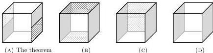

28:2

M. DORÉ, E. CAVALLO, AND A. MÖRTBERG

Vol. 22:2

# 1. INTRODUCTION

Homotopy type theory (HoTT) [Uni13] adds new constructs to intensional dependent type theory [ML75] reflecting an interpretation of types as homotopy types of topological spaces. This allows homotopy theory to be developed *synthetically* inside HoTT; many classical results have been reconstructed this way, such as the Hopf fibration [Uni13], Blakers-Massey theorem [HFLL16], Seifert-van Kampen theorem [HS16], Atiyah-Hirzebruch and Serre spectral sequences [vD18], Hurewicz theorem [CS23], etc. However, as originally formulated, HoTT postulates both the univalence axiom [Voe10] and the existence of HITs [Uni13] without proper computational content—to rectify this, *cubical type theories* [CCHM18, AFH18] replace the identity type with a primitive *path* type, yielding a computationally well-behaved theory which validates the axioms of HoTT.

Inspired by Daniel Kan's cubical sets [Kan55], cubical type theory represents elements of iterated identity types as higher-dimensional cubes. Synthetic homotopy theory in cubical type theory thereby attains a particular 'cubical' flavour [MP20]. A path in a type $A$ connecting elements $a$ and $b$ can be thought of as a function $p: [0, 1] \rightarrow A$ from the unit interval into the 'space' $A$ such that $p(0) = a$ and $p(1) = b$. Paths play the role of equalities in the theory, and operations on paths encode familiar laws of equality: reflexivity is a constant path, transitivity is concatenation of paths, and symmetry is following a path in reverse.

Paths can also be studied in their own right. In particular, we can consider equalities *between* paths in $A$, which as functions $[0, 1] \rightarrow ([0, 1] \rightarrow A)$ can be read as maps from the unit *square* (or *2-cube*) $[0, 1]^2$ to $A$; iterating, we find ourselves considering $n$-cubes in $A$. Algebraic laws such as the associativity of path concatenation or identity laws are represented as squares with certain boundaries.

For instance, a foundational result in algebraic topology is the *Eckmann-Hilton argument* [EH62], which states that concatenation of 2-spheres, i.e., 2-cubes with constant boundaries, is commutative up to a path. As a path between 2-cubes, the theorem is a 3-cube as shown in Figure 1(a): on the left we have a grey 2-cube concatenated with a hatched 2-cube, on the right they are concatenated in the opposite order, and the interior is the path between them.

FIGURE 1. A cubical Eckmann-Hilton argument in four steps.

In cubical type theory, we can construct such an interior by starting from some 3-cube we know can be filled, then deforming its boundary via certain basic operations until it has the desired form. It can be more intuitive to work backwards: deform the 'goal' boundary until we reach a boundary we can fill. Figure 1 shows one solution: we (b) shift the copies of the hatched 2-cube to the top and bottom faces, (c) further shift them both to the back face, whereupon they face each other in opposite directions, and then (d) cancel the concatenation of the hatched 2-cube with its inverse. The boundary in (d) can be filled immediately by the constant homotopy—i.e., reflexive equality—from the gray 2-cube to itself.