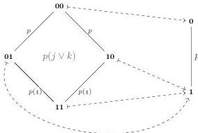

28:20

M. DORÉ, E. CAVALLO, AND A. MÖRTBERG

Vol. 22:2

*Proof.* This follows from Corollary 3.22 and the fact that there are finitely presented groups with undecidable word problem; see, e.g., Collins [Col86] for an example of the latter. □

#### 4. FINDING DEDEKIND AND DE MORGAN CONTORTIONS

We have seen that CARTESIAN and, to a lesser extent, DISJUNCTIVE are problems that can be feasibly solved by enumeration. In contrast, the search space for DEDEKIND and DEMORGAN quickly explodes, which make a brute-force approach infeasible even when solving boundary problems in lower dimensions. We hence need to explore the search space for Dedekind and De Morgan contortions more carefully. In §4.1, we will see how an alternative characterisation based on a Stone-type duality [Joh86], specifically Birkhoff's duality between finite distributive lattices and finite posets [Bir37], gives rise to a lossy but space-saving representation of collections of Dedekind contortions. We use this representation in §4.2 to develop an algorithm for solving DEDEKIND. We also have a duality between De Morgan algebras and finite poset maps, which allows us to adapt our space-saving representation of Dedekind contortions to also represent collections of De Morgan contortions (§4.3).

**4.1. Representing Dedekind contortions with potential poset maps.** Recall the example (2.4), where we contorted a path $p$ into a square using a Dedekind contortion $p(i) : [\ ] \mid j, k \vdash p(j \vee k)$ cell. We can think of $\vee$ as logical disjunction—if either $j$ or $k$ is $\mathbf{1}$, the contortion evaluates to $\mathbf{1}$. Similarly, we can treat the connection $\wedge$ as logical conjunction, which means that we can view any contortion as a tuple of propositional formulas. In fact a Dedekind contortion is uniquely determined by its truth table; for example, the contortion above is determined by the assignment $[\![\ -]\!]: \{0, \mathbf{1}\} \times \{0, \mathbf{1}\} \rightarrow \{0, \mathbf{1}\}$ defined by $[\![00]\!] = 0$ and $[\![01]\!] = [\![10]\!] = [\![11]\!] = \mathbf{1}$. In general, an $n$-term Dedekind contortion in $m$ variables gives a truth function $\{0, \mathbf{1}\}^m \rightarrow \{0, \mathbf{1}\}^n$.

Since a Dedekind contortion $\psi$ contains no negations, its truth function is *monotone*—we cannot make $\psi$ false by setting more variables to true. Thus the truth function induced by $\psi$ is in fact a map of posets $\mathbf{I}^m \rightarrow \mathbf{I}^n$, where $\mathbf{I}^k$ is the $k$-fold power of the poset $\mathbf{I} := \{0 < \mathbf{1}\}$ with its product ordering. Conversely, any map of posets $\mathbf{I}^m \rightarrow \mathbf{I}^n$ determines a unique $n$-term contortion in $m$ variables. For example, we can depict the poset map corresponding to $j \vee k$ as an assignment between the posets $\mathbf{I}^2$ and $\mathbf{I}^1$, which we draw as a Hasse diagram below.

