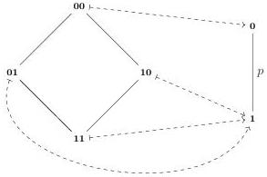

Vol. 22:2

AUTOMATING BOUNDARY FILLING IN CUBICAL TYPE THEORIES

28:23

single poset map: $\Sigma(000) = \{00\}$, $\Sigma(001) = \Sigma(010) = \Sigma(011) = \Sigma(100) = \Sigma(101) = \{01\}$ and $\Sigma(110) = \Sigma(111) = \{11\}$. Translating this poset map to a contortion gives rise to a solution for our boundary problem: $\Gamma \mid i, j, k \vdash_c s(i \wedge j, i \vee j \vee k) : [\phi]$

Our algorithm finds this solution quickly since the search space is restricted to only 10 possible contortions after looking at the first face of $\phi$. This contrasts with brute-force search, where we would have to check $D(3)^2 = 400$ contortions. The increase in speed gets apparent for a larger goal: a 6-dimensional analogue of the above proof goal can be found by unfolding less than 16000 poset maps. A brute-force search would have to find a solution in a search space with $D(6)^2 = 7\,828\,354^2 = 61\,283\,126\,349\,316$ contortions.

4.3. De Morgan contortions as poset maps. The most expressive contortion theory that we consider are the De Morgan contortions which can be formed with both $\wedge$, $\vee$ as well as a unary operator $\sim$ which captures reversal of paths. In fact, the number of De Morgan contortions grows with the even Dedekind numbers, i.e., there are $D(2m)$ many ways to contort a 1-cube into an $m$-dimensional cube using a De Morgan contortion. These combinatorics suggest a connection with Dedekind formulas, and indeed any De Morgan contortion over $m$ variables corresponds to a monotone boolean function in $2m$ variables [MA14, Theorem 3.2] [GWW03]. Intuitively, we can regard a variable $j$ and its inverse $\sim j$ separately since, e.g., $j \vee \sim j$ is in normal form and does not reduce to 1. We can hence reuse our potential poset maps to also represent De Morgan contortions, and thereby obtain a space-efficient representation for this comprehensive contortion theory. Our construction is reminiscent of the proof of coNP-hardness of equivalence between monotone Boolean formulas using a reduction from the tautology problem [Rei03].

Consider again the cell context from above, but we now contort $p$ into another 1-dimensional path using a De Morgan contortion: $p(i) : [\ ] \mid j \vdash p(j \vee \sim j)$ cell. The poset map corresponding to $j \vee \sim j$ has two variables, one for $j$ and one for $\sim j$, and captures that we take the disjunction of both literals.

Of interest to us is the antichain consisting of 01 and 10, which are both sent to 1, which captures that both $j$ and $\sim j$ are present in the contortion. Note that we cannot read off the boundary of the contorted term directly from the poset map anymore ($p(j \vee \sim j)$ is a 1-dimensional path after all), but that we have to focus on the part of the poset map that corresponds to a “consistent” assignment of truth values to the variables. In this case, these are precisely 01 and 10, inspecting their values under the poset map allows us to compute