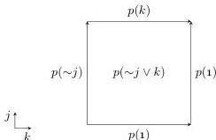

28:24

M. DORÉ, E. CAVALLO, AND A. MÖRTBERG

Vol. 22:2

the boundary of the contorted term, i.e., $p(j \vee \sim j) : [j = 0 \mapsto p(1) \mid j = 1 \mapsto p(1)]$. We hence have another solution to a boundary problem that could have been also solved simply with $p(1)$.

The power of De Morgan contortions comes from the fact that we can directly reverse paths as discussed in §2.1, which gives us a rich language also for higher contortions. For example, the contortion $p(i) : [\ ] \mid j, k \vdash p(\sim j \vee k)$ cell corresponds to a square where between the bottom left and top right corner we once travel along the inverse $p$ and $p$, and once constantly stay at $p(1)$.

We can intuit the poset map $\sigma : \mathbf{I}^4 \to \mathbf{I}^1$ corresponding to the contortion $\sim j \vee k$ as follows. An element of the domain $x \in \mathbf{I}^4$ has four indices, where $x_1$ stands for $j$, $x_2$ for $k$, $x_3$ for $\sim j$ and $x_4$ for $\sim k$. The antichain which determines $\sigma$ is consequently 0010 and 0100, corresponding to $\sim j$ and $k$, respectively.

The total potential poset map $\Sigma : \mathbf{I}^4 \to \mathbf{I}^1$ is again a space-efficient representation of all $D(4) = 168$ De Morgan contortions of $p$ into a square, and we can restrict a potential poset map corresponding to De Morgan contortions similarly to Algorithm 1 to gradually construct a contortion involving reversals.

By constructing De Morgan contortions in this way, we can find compact solutions to lower-dimensional boundary problems for theories which support reversals (such as Cubical Agda). However, this approach is not very practical for higher-dimensional boundary problems as the space of possible contortions grows too quickly.

## 5. FINDING KAN FILLERS

We now turn to KAN and develop an algorithm for solving general boundary problems. Recall that a Kan cell is of the form $\text{fill}^{e \to r} i.[\phi] u$, where $\phi$ and $u$ constitute an “open box” which is filled in direction $e \to r$. Searching for such fillers requires a different approach depending on whether $r$ is a dimension variable or an endpoint. In the former case, $\text{fill}^{e \to j} i.[\phi] u$ has the same dimension as $\phi$ and has $\text{fill}^{e \to \bar{e}} i.[\phi] u$ as its $j = \bar{e}$ face. This means that it is easy to recognise if a boundary problem can be solved by a filler $e \to j$: we simply have to check if some face of the goal boundary is an $e \to \bar{e}$ filler. We hence call the filler in direction $e \to j$ the “natural filler” for a goal boundary which has $\text{fill}^{e \to \bar{e}} i.[\phi] u$ at side $j = \bar{e}$.

In contrast, determining when we have to introduce $e \to \bar{e}$ fillers is difficult. We focus our attention on fillers in direction $0 \to 1$, since such a filler can be constructed if and only if we can construct a filler in the converse direction. Note that a cell $\text{fill}^{0 \to 1} i.[\phi] u$ is of one dimension less than the open box spanned by $\phi$ and $u$—put differently, to solve a given goal boundary by a $0 \to 1$ filler, we need to first construct a higher-dimensional cube. We hence