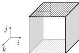

28:26

M. DORÉ, E. CAVALLO, AND A. MÖRTBERG

Vol. 22:2

A solution is a choice of one element of each domain, i.e., $t_X \in D_X$ for all $X \in Var$, s.t., all constraints are satisfied, i.e., $C(t_X, t_{X'})$ for all $C, X, X'$.

We now state the CSP for filling boundaries via Kan fillers that have only contortions as sides.

**Definition 5.2.** Given a boundary $\Gamma \mid \Psi \vdash \phi$ **bdy** and a fresh dimension $k \notin \Psi$, as well as a set of indices $Ope \subseteq \{(k = \mathbf{0})\} \cup \{(i = e) \mid i \in \Psi, e \in \{\mathbf{0}, \mathbf{1}\}\}$, the CSP KANCSP($\phi, Ope$) is given as follows:

- $Var := \{X_{(i=e)} \mid i \in \Psi, e \in \{\mathbf{0}, \mathbf{1}\}, (i = e) \notin Ope\} \cup \{X_{(k=\mathbf{0})} \text{ if } (k = \mathbf{0}) \notin Ope\}$
- $D_{(i=e)} := \{(p, \text{Conts}(\Psi, \Psi')) \mid p(\Psi') : [\phi'] \in \Gamma\}$
- and constraints for all $\Psi \vdash i, j$ **atom**, $e, e' \in \{\mathbf{0}, \mathbf{1}\}$:

$$\Gamma \mid \Psi[i = e] \vdash_c X_{(i=e)}[k = \mathbf{1}] = \phi[i = e] \text{ cell if } (i, e) \text{ specified in } \phi$$

$$\Gamma \mid \Psi[i = e][j = e'] \vdash_c X_{(i=e)}[j = e'] = X_{(j=e')}[i = e] \text{ cell}$$

The CSP contains a variable for any side of the boundary that is not left open, the domains contain pairs representing all contortions of a cell $p$ into the needed dimension. The first set of constraints ensures that all sides agree with the goal boundary, while the second set of constraints makes sure that all sides have mutually matching boundaries.

If $Ope$ contains only sides which are unspecified in $\phi$, a solution KANCSP($\phi, Ope$) is a solution to the boundary problem $\phi$:

$$\Gamma \mid \Psi \vdash \text{fill}^{\mathbf{0} \to \mathbf{1}} \ k. [i = e \mapsto t_{(i,e)} \text{ for } i \in \Psi, e \in \{\mathbf{0}, \mathbf{1}\}, (i = e) \notin Ope] \ t_{(k,\mathbf{0})} : [\phi]$$

When calling the solver, one has to carefully consider which underlying contortion theory one should choose. For higher-dimensional problems, the De Morgan contortions are often too unwieldy since the domain of the poset maps grows with the even Dedekind numbers.

Take for example the Eckmann-Hilton argument, the cubical version of which we introduced in §1. If we were to solve the cube presented in Figure 1(b) using De Morgan contortions, we would have to consider of the order of $D(6)^2 = 7\,828\,354^2$ possible contortions. Since the cube in the example can be constructed without reversals, it is more expedient to instead use the Dedekind contortion theory, leading to a different filler than that depicted in Figure 1(c) and Figure 1(d).

**Example 5.3** (The Eckmann-Hilton cube). Using Dedekind contortions, we want to fill the cube from Figure 1(b), where we are given a cell context $\Gamma$ with a point $x : [ ]$ and two squares $p(i, j)$ and $q(i, j)$ with boundaries $[i = \mathbf{0} \mapsto x \mid i = \mathbf{1} \mapsto x \mid j = \mathbf{0} \mapsto x \mid j = \mathbf{1} \mapsto x]$, and which are assembled into:

$$\Gamma \mid i, j, k \vdash \left[ \begin{array}{lll} i = \mathbf{0} \mapsto p(j, k) \mid & j = \mathbf{0} \mapsto q(i, k) \mid & k = \mathbf{0} \mapsto x \\ i = \mathbf{1} \mapsto p(j, k) \mid & j = \mathbf{1} \mapsto q(i, k) \mid & k = \mathbf{1} \mapsto x \end{array} \right] \text{ bdy}$$

Our boundary problem hence corresponds to the cube from Figure 1(b), where the gray 2-cubes of the $i$ sides are filled with $p$, the $j$ sides with $q$, and the $k$ sides are constantly $x$ (note also that all corner points of the cube are judgmentally equal to $x$):

