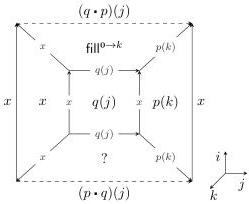
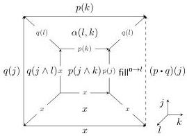

Vol. 22:2

AUTOMATING BOUNDARY FILLING IN CUBICAL TYPE THEORIES

28:29

hence more general—version of the boundary problem. Concretely, the cube from Figure 1(b) is captured with a square

$$\Gamma := \left\{ \begin{array}{l} x : [ \ ], \\ p(i) : [ i = \mathbf{0} \mapsto x \mid i = \mathbf{1} \mapsto x ], \\ q(i) : [ i = \mathbf{0} \mapsto x \mid i = \mathbf{1} \mapsto x ], \\ \alpha(i, j) : \left[ \begin{array}{c c} i = \mathbf{0} \mapsto p(j) & j = \mathbf{0} \mapsto q(i) \\ i = \mathbf{1} \mapsto p(j) & j = \mathbf{1} \mapsto q(i) \end{array} \right] \end{array} \right.$$

$$\begin{array}{c} p(j) \\ q(i) \xrightarrow{\alpha} q(i) \\ \boxed{p(j)} \end{array} \begin{array}{c} i \\ j \end{array}$$

that we want to turn into a square with both path concatenations on opposite sides:

$$\Gamma \mid i, j \vdash ? : [ i = \mathbf{0} \mapsto (p \cdot q)(j) \mid i = \mathbf{1} \mapsto (q \cdot p)(j) \mid j = \mathbf{0} \mapsto x \mid j = \mathbf{1} \mapsto x ] \tag{5.1}$$

Incidentally, $\Gamma$ is the list of generators of the HIT capturing the Torus in agda/cubical, while boundary (5.1) captures $T^2$, the definition of the torus in the HoTT book [Uni13]. A solution to this problem thus induces a map from the cubical torus to the HoTT book torus.

We solve (5.1) using Algorithm 3. After seeing that we cannot solve this goal with a contortion, the algorithm at some point reaches depth $d = 3$ and solves KANCSP with open sides $Ope = \{(i = \mathbf{0}), (i = \mathbf{1})\}$. A solution to this CSP has the constant $x$ square for $j = \mathbf{0}$, $p(k)$ for $j = \mathbf{1}$ and $q(j)$ for $k = \mathbf{0}$ as depicted in the left cube below.

When calling KANSOLVER recursively on the two missing sides, we find with KANFILL that the $i = \mathbf{1}$ side can be solved with the natural filler for $q \cdot p$. To fill side $i = \mathbf{0}$, we again have to construct an open cube. One solution of KANCSP for this open cube is depicted on the right below. The $k = \mathbf{1}$ side is filled by the natural filler for $p \cdot q$. The other sides can be filled with contortions, where side $j = \mathbf{1}$ makes use of $\alpha$.

While the Dedekind contortions are quite powerful and were an apt contortion theory to prove Eckmann-Hilton, it can often be useful to have reversal $\sim$ available, in particular for lower-dimensional proof goals where the even faster blowup of the number of De Morgan contortions is not so severe.

Example 5.5 (Associativity of path concatenation). Given a context $\Gamma$

$$p(i) : [ \ ], q(i) : [ i = \mathbf{0} \mapsto p(\mathbf{1}) \ ], r(i) : [ i = \mathbf{0} \mapsto q(\mathbf{1}) \ ]$$