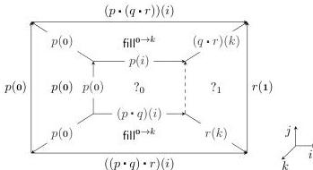
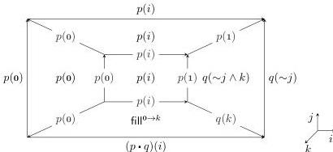

28:30

M. DORÉ, E. CAVALLO, AND A. MÖRTBERG

Vol. 22:2

we want to show that path composition as defined in §2 is associative. This amounts to constructing a term with the following boundary.

$$\Gamma \mid i, j \vdash [j = 0 \mapsto ((p \cdot q) \cdot r)(i) \mid j = 1 \mapsto (p \cdot (q \cdot r))(i) \mid i = 0 \mapsto p(0) \mid i = 1 \mapsto r(1)] \text{ bdy}$$

To solve this boundary problem, the solver constructs an open 3-cube and finds that almost no sides of it can be filled with a contorted cell: the $j$ sides have a Kan filler on their boundary and are hence best filled using the natural fillers. This means that the back and right side of the box will also have a path composition on their boundary. Hence only the left side can be filled with a contortion, namely the square which is constantly $p(0)$. In sum, the CSP solver called at line 7 returns the following box, where the fillers $?_0$ and $?_1$ for sides $i = 1$ and $k = 0$ need to be constructed by calling the solver recursively.

For the back side at $k = 0$, the boundary problem $?_0$ has an open right side as we do not know what the common boundary of $?_0$ and $?_1$ should be. The solver hence constructs a constraint satisfaction problem with the right-hand side $i = 1$ free. The goal boundary of this line is $[j = 0 \mapsto q(1) \mid j = 1 \mapsto p(1) = q(0)]$, which suggests that a De Morgan contortion involving reversal $\sim$ will come in handy. Indeed, when calling the solver for $?_0$, it again constructs an open 3-cube, uses the natural filler for $p \cdot q$ for the $j = 0$ square, and is able to fill all other sides with contortions as follows.

The contortion $\sim j \wedge k$ was picked out among $D(4) = 168$ possible contortions of $q$, which can be represented with a PPM $\mathbf{I}^4 \rightarrow \mathcal{P}(\mathbf{I})$ containing only 16 entries.