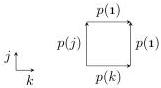

28:8

M. DORÉ, E. CAVALLO, AND A. MÖRTBERG

Vol. 22:2

which we picture as the following unfilled square:

The compatibility condition in the formation rule ensures that we can only form this boundary when the edges of the squares actually line up on the intersections; for example, when we add the final face $k = \mathbf{1} \mapsto p(\mathbf{1})$, we must check that $p(k) = p(\mathbf{1})$ when both $j = \mathbf{0}$ and $k = \mathbf{1}$.

**Remark 2.9.** The requirement that the term $r$ in a constraint $r = e$ is atomic is absent in Cubical Agda. Imposing it simplifies the constrained context operation (Definition 2.6), while relaxing it is not particularly useful for practical boundary solving. We distinguish between substitutions and contortions to make this requirement sensible.

Finally, we can introduce the main protagonists of our contortion theory: the cells that stem from contorting some generating cell of the cell context.

**Definition 2.10.** A **contorted cell** $\Gamma \mid \Psi \vdash_c t$ **cell** is a contortion $\psi$ applied to a variable $a$ from the cell context:

$$\frac{(a(\Psi') : [\phi]) \in \Gamma \qquad \psi : \Psi \rightsquigarrow \Psi'}{\Gamma \mid \Psi \vdash_c a(\psi) \text{ cell}}$$

We write $a$ instead of $a()$ when $\Psi' = ()$. Equality of contorted cells is generated by the rule

$$\frac{(a(\Psi') : [\phi]) \in \Gamma \qquad (r = e \mapsto t) \in \phi \qquad \psi : \Psi \rightsquigarrow \Psi' \qquad \Psi \vdash r\langle\psi\rangle = e\langle\psi\rangle \text{ dim}}{\Gamma \mid \Psi \vdash_c a(\psi) = t\langle\psi\rangle \text{ cell}}$$

which is to say that $a(\psi)$ has exactly the boundary assigned to it by the context. Additionally, all contorted cells are considered equal in the inconsistent dimension context $\bot$.

We write $\Gamma \mid \Psi \vdash_c t : [\phi]$ when $t$ is a cell agreeing with $\phi$, i.e., such that $t[r = e] = t'$ **cell** for each $(r = e \mapsto t') \in \phi$. The two rules above can then be restated as the single rule

$$\frac{(a(\Psi') : [\phi]) \in \Gamma \qquad \psi : \Psi \rightsquigarrow \Psi'}{\Gamma \mid \Psi \vdash_c a(\psi) : [\phi\langle\psi\rangle]}$$

For example, (2.4) applies the contortion $(j \vee k) : (j, k) \rightsquigarrow (i)$ to a 1-cell $p(i)$ to define a contorted cell $p(i) : [\ ] \mid j, k \vdash_c p(j \vee k)$ **cell** matching the boundary (2.5).

**Remark 2.11.** For ease of reading, we have described the action of substitutions and contortions above as a meta-operation on raw terms, replacing dimension variables by terms in the expected way. Formally, however, we shall consider the theory to come with a calculus of explicit substitutions as described by Abadi et al. [ACCL91]. That is, for example, the action of substitutions on terms is given by a term former

$$\frac{\Gamma \mid \Psi \vdash_c t \text{ cell} \qquad \psi : \Psi' \to \Psi}{\Gamma \mid \Psi' \vdash_c t[\psi] \text{ cell}}$$

whose behaviour is specified by equations such as $a(\psi)[\psi'] = a(\psi\psi')$. We make use of this formal description in §3.2, where we prove some results by induction on syntax.