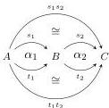
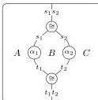
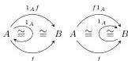
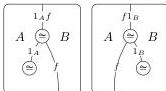
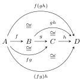
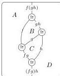
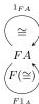
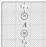

DOUBLY WEAK DOUBLE CATEGORIES

11

isomorphisms):

- The components of left and right unitors and associators are induced by the composition isomorphisms (by de-composing then re-composing):

Proof. Functoriality, naturality, pentagon, and triangle follow from composition isomorphisms cancelling with their inverses. □

We call this the “underlying bicategory” of a represented implicit 2-category.

**Proposition 2.8.** A functor between represented implicit 2-categories $F: \mathbf{C} \rightarrow \mathbf{D}$ (not necessarily preserving the chosen composition isomorphisms) induces a pseudofunctor between the underlying bicategories as follows:

- The functor is $F$ on 0-cells, 1-cells, and 2-cells (bigons).
- The coherence isomorphisms $1_{FA} \rightarrow F1_A$ and $(Ff)(Fg) \rightarrow F(fg)$ are built from the chosen composition isomorphisms (by de-composing in $\mathbf{D}$ and re-composing in $\mathbf{C}$):

