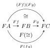
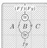

12

AARON DAVID FAIRBANKS AND MICHAEL SHULMAN

*Proof.* Naturality and coherence axioms follow from composition isomorphisms cancelling with their inverses. □

Any represented implicit 2-category is canonically identified with the underlying implicit 2-category of its underlying bicategory: by composing with chosen isomorphisms, the 2-cells with arbitrary boundary are in composition-respecting correspondence with bracketed bigons. Likewise, any implicit 2-category functor is recovered from its underlying pseudofunctor: the underlying implicit 2-category functor is defined in the same way on bigons and composition isomorphisms, and therefore on all 2-cells. Hence, we obtain:

**Proposition 2.9.** *The category of bicategories (and pseudofunctors) is equivalent to the category of representable implicit 2-categories (and implicit 2-category functors).* □

Moreover, by construction, a pseudofunctor having identities as the coherence isomorphisms corresponds to an implicit 2-category functor preserving chosen composition isomorphisms on the nose, so we also obtain:

**Corollary 2.10.** *The category of bicategories and strict functors is equivalent to the category of represented implicit 2-categories and strict functors (functors that preserve the chosen composition isomorphisms).* □

*Remark 2.11.* Other characterizations of implicit 2-categories as structure on 2-categories are as follows: they are the flexible algebras of the strict 2-category 2-monad on **Cat**-enriched graphs (this can be deduced from [Lac02b, Theorem 4.8]); they are also the “pie” algebras of this 2-monad in the terminology of [BG13]; and they are the cofibrant objects in the canonical model structure on 2-categories from [Lac02b, Lac04]. Moreover the evident (path 2-category) functor **I-2-Cat** → **2-Cat** is comonadic, as shown in [Had21, Proposition 2.5]. In particular, pseudofunctors are *weak maps* of 2-categories in the sense of [Gar10b, BG16].

We also note that results analogous to those in this section appear in [Had19, Section 5] about a structure similar to an implicit 2-category, except not allowing 2-cells with nullary inputs or outputs or parallel composition, and with a different treatment of nullary composites. Results similar to our Appendix A (in which we discuss transformations and modifications) are covered there as well in the same context.

### 3. DOUBLY WEAK DOUBLE CATEGORIES

Now we quickly define doubly weak double categories, using strict double categories by analogy to Section 2. (Later in Section 4 and Section 5 we will use a more systematic approach, building the essentially algebraic implicit structures from the ground up.)