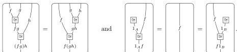
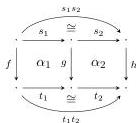
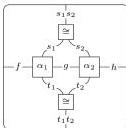

16

AARON DAVID FAIRBANKS AND MICHAEL SHULMAN

Equivalently, for all horizontal $f: A \rightarrow B$, $g: B \rightarrow C$, and $h: A \rightarrow B$, we have $(fg)h = f(gh)$ and $1_A f = f = f1_B$, and likewise

Similarly, it is **vertically strict** if its underlying vertical bicategory is strict, and it is **strict** if it is both horizontally and vertically strict.

**Proposition 3.13.** *The category of vertically strict doubly weak double categories and vertically strict functors (resp. strict functors) is equivalent to the category of pseudo double categories and pseudofunctors (resp. strict functors).*

*Proof.* The proof follows the same blueprint as Proposition 2.9, which we walk through again in this case.

Every pseudo double category $\mathcal{C}$ has an underlying vertically strict doubly weak double category with the same 0-cells and 1-cells, and where a 2-cell with any boundary is a family consisting of a choice of square in $\mathcal{C}$ for every possible bracketing of the source and target in the weak (horizontal) direction, such that these squares are related by composing with the relevant coherence isomorphisms (a.k.a. a *clique morphism*). Composition is as in $\mathcal{C}$, and composition isomorphisms are given by identities, as in Proposition 2.5.

Likewise every pseudo double functor $\mathcal{F}$ has an underlying vertically strict functor of implicit double categories, defined as $\mathcal{F}$ on 0-cells and 1-cells, and with the map on 2-cells induced by composing with pseudofunctor coherence isomorphisms, as in Proposition 2.6. (Note that coherence for pseudofunctors of bicategories applies just as well here, since a pseudo double functor in particular includes pseudofunctors between underlying bicategories.)

Conversely, every vertically strict doubly weak double category $\mathbf{C}$ has an underlying pseudo double category with the same 0-cells, 1-cells, and *square* 2-cells (those bordered by length one paths), and with identities and compositions derived from those in $\mathbf{C}$:

