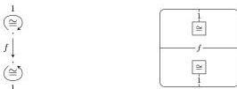

DOUBLY WEAK DOUBLE CATEGORIES

17

(There are analogous diagrams for vertical identities and compositions.) The coherence data are built from the chosen composition isomorphisms just as in Proposition 2.7.

Likewise every vertically strict functor $F$ between vertically strict doubly weak double categories has an underlying pseudo double functor (see [GP99] for a precise definition of pseudo double functor), defined as $F$ on all cells, and with coherence data built from the chosen composition isomorphisms, just as in Proposition 2.8.

That these assignments constitute an equivalence of categories, as in Proposition 2.9, is a series of straightforward verifications. Moreover, strict functors of doubly weak double categories correspond to strict functors of pseudo double categories because preservation of chosen composition isomorphisms amounts to triviality of coherence isomorphisms, as in Corollary 2.10. $\square$

**Corollary 3.14.** *The category of strict doubly weak double categories and strict functors is equivalent to the category of strict double categories.* $\square$

*Remark 3.15.* Keisuke Hoshino has shown that there is an analogue of Remark 2.11 for double categories as well. That is, the category of implicit double categories is comonadic over that of strict double categories, with the comonad being a cofibrant replacement; thus double pseudofunctors are the *weak maps* of double categories in the sense of [Gar10b, BG16].

#### 4. DOUBLE COMPUTADS

We next embark on a more algebraic treatment of implicit and doubly weak double categories, starting with the definition of double computads. For comparison and later use, we first recall some details about computads for 1-categories and 2-categories. By a **1-computad** we will mean simply a directed (multi)graph, a.k.a. quiver. The category **1-Cptd** of 1-computads is a functor category $[\mathbb{C}_1, \mathbf{Set}]$ with domain $\mathbb{C}_1$ given by the category

$$1 \Rightarrow 0.$$

The category **1-Cat** of (small) 1-categories is monadic over 1-computads, via an adjunction which we write

$$\text{1-Cptd} \xleftarrow[\mathcal{U}_1]{\mathcal{F}_1} \text{1-Cat}$$

with induced monad $T_1 = \mathcal{U}_1\mathcal{F}_1$. When $X$ is a 1-computad, the 0-cells in $T_1X$ are the same as in $X$, and the 1-cells in $T_1X$ are paths in $X$. We denote by $\Rightarrow$ the 1-computad containing two objects and two parallel arrows between them.

**Definition 4.1.** A **2-computad** consists of a 1-computad $X_{\leq 1}$, together with a set $X_2$ of 2-cells and a function $\partial$ sending each 2-cell to a parallel pair of paths in