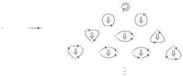
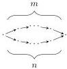

18

AARON DAVID FAIRBANKS AND MICHAEL SHULMAN

FIGURE 1.  \( C_{2} \)  consists of the “shapes of cell” in a 2-computad.

\(X_{\leq 1}\) (its boundary):

\[
\partial \colon X _ {2} \longrightarrow 1 - \mathbf {C p t d} (\Rightarrow , T _ {1} X _ {\leq 1}).
\]

We denote by 2-Cptd the category of 2-computads, defined as the comma category of Set over 1-Cptd( \( \Rightarrow T_{1}- \) ).

The following theorem allows us to quickly deduce that 2-Cptd is itself a presheaf category. \( ^{8} \)  Recall that a functor  \( G: C \to D \)  is a parametric right adjoint if C has a terminal object 1 and the induced  \( \widetilde{G}: C \to D/G1 \)  has a left adjoint.

Theorem 4.2 ([CJ95]). Given a functor between presheaf categories \( G \colon [\mathbb{C}, \mathbf{Set}] \to [\mathbb{D}, \mathbf{Set}] \), the comma category (a.k.a. Artin gluing) ([D, Set]/G) is again a presheaf category [E, Set] if and only if \( G \colon [\mathbb{C}, \mathbf{Set}] \to [\mathbb{D}, \mathbf{Set}] \) is a parametric right adjoint.

For functors between well-behaved categories such as presheaf categories  \( C = [C, Set] \)  and  \( D = [D, Set] \) , parametric right adjoints are equivalently the functors preserving connected limits. When moreover D = Set, parametric right adjoints are simply coproducts of representable functors.

Indeed, \( T_{1} \) and 1-Cptd(\( \Rightarrow \), -) are both parametric right adjoints, thus so is their composite; hence by Theorem 4.2 there is a category \( \mathbb{C}_2 \) such that 2-Cptd \( \cong [\mathbb{C}_2, \mathbf{Set}] \). Moreover the proof of this theorem in [CJ95] tells us how to explicitly describe the domain category, giving us the definition of \( \mathbb{C}_2 \) written below and shown graphically in Figure 1. (It is also not difficult to verify directly from the definition that functors \( \mathbb{C}_2 \to \mathbf{Set} \) are identified with 2-computads.)

The category \(\mathbb{C}_2\) has objects 0, 1, and \(2_{n}^{m}\) for natural numbers \(m, n \in \mathbb{N}\), and the morphisms are as follows:

- The full subcategory of objects 0 and 1 is \(\mathbb{C}_1\).
- The only arrows into the objects \(2_{n}^{m}\) are identities.
- For each \(m, n \in \mathbb{N}\), the homsets from \(2_{n}^{m}\) into 0 and 1, acted on by composing arrows in \(\mathbb{C}_1\), determine the 1-computad representing a pair of parallel paths of lengths \(m\) and \(n\):

\( ^{8} \) This fact was apparently first observed by Schanuel, as mentioned in [CJ95].