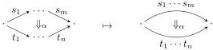

DOUBLY WEAK DOUBLE CATEGORIES

19

As in Section 2, we refer to 2-cells of shape \(2_{1}^{1}\) as bigons:

A 2-computad in which all 2-cells are bigons is called a 2-graph (a.k.a. 2-globular set). We denote this full subcategory of 2-Cptd by 2-Gph, also a functor category with domain a full subcategory of \(\mathbb{C}_2\):

\[
2 \Rightarrow 1 \Rightarrow 0.
\]

(composition laws as in \(\mathbb{C}_2\), where \(2 := 2_1^1\)).

The category 2-Gph is also a comma category (Set/1-Cptd( \( \Rightarrow \) , -)), so we have a functor from 2-Cptd = (Set/1-Cptd( \( \Rightarrow \) ,  \( T_{1}- \) )) to 2-Gph given by applying  \( T_{1} \)  to the 1-cells, which reinterprets all of the 2-cells in a 2-computad as bigons between paths.

This is more precisely a functor  \( \iota_{2} \) : 2-Cptd → 1-Cat-2-Gph where the codomain is 2-graphs equipped with 1-category structure on 1-cells. Note that this category 1-Cat-2-Gph is evidently monadic over 2-Gph.

The functor  \( \iota_{2} \)  is pseudomonic; its image consists of 2-graphs equipped with free 1-category structure and maps sending generating 1-cells to generating 1-cells. Thus 2-computads are equivalently such structured 2-graphs.

The category 2-Cat of (small, strict) 2-categories is also monadic over 2-Gph, essentially by definition (as a 2-graph equipped with various operations). The forgetful right adjoint evidently factors through an intermediate right adjoint 2-Cat → 1-Cat-2-Gph, which is also monadic by the following lemma.

Lemma 4.3 ([Bou92, Propositions 4 and 5]). If \( G_{3} = G_{2} \circ G_{1} \), where \( G_{2} \) and \( G_{3} \) are monadic and all three functors have left adjoints, then \( G_{1} \) is also monadic.

In the next section we will see that 2-Cat is monadic over 2-Cptd as well, but this is less straightforward. (Street [Str76] asserted this by a monadicity theorem, but it seems nontrivial to verify the hypotheses.)

It is time to move on to double computads. Here the roles of 1-computads and 1-categories are played by structures which we call  \( 1 \vee 1 \) -computads and  \( 1 \vee 1 \) -categories; these are like double categories but without any 2-cells.

Definition 4.4. A \(1 \vee 1\)-computad \(X\) consists of two 1-computads (directed graphs) with the same set of 0-cells (vertices) \(X_0\). We refer to the two kinds of 1-cell as horizontal and vertical and draw them accordingly. The category \(1 \vee 1\)-Cptd of \(1 \vee 1\)-computads is a functor category \([\mathbb{C}_{1 \vee 1}, \mathbf{Set}]\), with domain \(\mathbb{C}_{1 \vee 1}\) given by the category

\[
1 ^ {H} \Rightarrow 0 \Leftarrow 1 ^ {V}.
\]

Remark 4.5. This category \(\mathbb{C}_{1\vee 1}\) is the category of elements of the 1-computad \(A\colon \mathbb{C}_1\to \mathbf{Set}\) defined by \(A(0) = \{0\}\) and \(A(1) = \{1^{H},1^{V}\}\). Thus we can also write \(1\vee 1\text{-}\mathbf{Cptd} = 1\text{-}\mathbf{Cptd} / A\). There are hence projection functors

\[
\Diamond \colon \mathbb {C} _ {1 \vee 1} \to \mathbb {C} _ {1} \qquad \text { and } \qquad \Diamond_ {!} \colon 1 \vee 1 \text {- - Cptd} \to 1 \text {- - Cptd}
\]