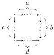

20

AARON DAVID FAIRBANKS AND MICHAEL SHULMAN

which forget the distinction between horizontal and vertical arrows.

Similarly, a 1∨1-category consists of two categories with the same set of objects; 1∨1-categories are monadic over 1∨1-computads via an adjunction

$$1 \vee 1\text{-Cptd} \xrightarrow[\mathcal{U}_{1 \vee 1}]{\mathcal{F}_{1 \vee 1}} 1 \vee 1\text{-Cat}$$

with induced monad $T_{1 \vee 1}$. Let $\square$ denote the 1∨1-computad with four objects and two arrows of each sort, forming a square:

Definition 4.6. A double computad consists of a 1∨1-computad $X_{\leq 1}$, together with a set $X_2$ of 2-cells and a function $\partial$ sending each 2-cell to a square of paths in $X_{\leq 1}$ (its boundary):

$$\partial: X_2 \longrightarrow 1 \vee 1\text{-Cptd}(\square, T_{1 \vee 1} X_{\leq 1}).$$

We write DblCptd for the category of double computads, the comma category of Set over 1∨1-Cptd($\square$, $T_{1 \vee 1}$—).

Like $T_1$, the monad $T_{1 \vee 1}$ is a parametric right adjoint. Thus, by Theorem 4.2, DblCptd is also a functor category $[\mathbb{C}_d, \mathbf{Set}]$. We describe $\mathbb{C}_d$ by the same process we used to describe $\mathbb{C}_2$. We find that the objects are $0, 1^H, 1^V$, and $2_{c,d}^{a,b}$ for natural numbers $a, b, c, d \in \mathbb{N}$, and the morphisms are as follows:

- The full subcategory of objects $0, 1^H$, and $1^V$ is $\mathbb{C}_{1 \vee 1}$.
- The only arrows into the objects $2_{c,d}^{a,b}$ are identities.
- For $a, b, c, d \in \mathbb{N}$, the homsets from $2_{c,d}^{a,b}$ into $0, 1^H$, and $1^V$, acted on by composing arrows in $\mathbb{C}_d$, determine the 1∨1-computad representing a square of paths of lengths $a$ (top), $b$ (right), $c$ (left), and $d$ (bottom):

Remark 4.7. We also have that $\mathbb{C}_d$ is the category of elements of a certain 2-computad $B: \mathbb{C}_2 \to \mathbf{Set}$, which we can see in the following way.

Composing $\diamond_!: 1 \vee 1\text{-Cptd} \to 1\text{-Cptd}$ from Remark 4.5 with $1\text{-Cptd}(\Rightarrow, T_1-) : 1\text{-Cptd} \to \mathbf{Set}$ yields a functor $1 \vee 1\text{-Cptd} \to \mathbf{Set}$, which sends a 1∨1-computad to the set of pairs of parallel paths of 1-cells of either sort. We also have the functor $1 \vee 1\text{-Cptd}(\square, T_{1 \vee 1}-)$, which sends a 1∨1-computad to the set of parallel pairs of paths where the first consists of horizontal 1-cells followed by vertical 1-cells and the second consists of vertical 1-cells followed by horizontal 1-cells.

Forgetting this requirement on the pairs of paths yields a natural transformation $\alpha: 1 \vee 1\text{-Cptd}(\square, T_{1 \vee 1}-) \hookrightarrow 1\text{-Cptd}(\Rightarrow, T_1 \diamond_! -)$. This transformation is cartesian, i.e. its naturality squares are pullbacks. In this case, cartesianness