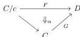

DOUBLY WEAK DOUBLE CATEGORIES

21

corresponds to the fact that whether an element of $1\text{-}\mathbf{Cptd}(\Rightarrow, T_1 \diamond! X)$ lifts to $1 \vee 1\text{-}\mathbf{Cptd}(\square, T_{1 \vee 1} X)$ is determined solely by its “shape”, i.e. the induced element of $1\text{-}\mathbf{Cptd}(\Rightarrow, T_1 \diamond! 1)$ (a pair of sequences of the values $1^H$ and $1^V$).

By the following lemma, we have $\mathbf{DblCptd} = 2\text{-}\mathbf{Cptd}/B$, where $B$ is the 2-computed in $1 \vee 1\text{-}\mathbf{Cptd} = 1\text{-}\mathbf{Cptd}/A$ corresponding to $\alpha_1: 1 \vee 1\text{-}\mathbf{Cptd}(\square, T_{1 \vee 1}1) \rightarrow 1\text{-}\mathbf{Cptd}(\Rightarrow, T_1 A)$.

**Lemma 4.8.** *If $\alpha$ is a cartesian natural transformation*

*then the comma category $(D/F)$ is a slice category of the comma category $(D/G)$. Namely, $(D/F) \cong (D/G)/\alpha_1$, the slice over the object $\alpha_1: F(1) \rightarrow G(c)$.*

*Proof.* Since $\alpha$ is cartesian, for any object $f: c' \rightarrow c$ of $C/c$ we have a pullback

$$\begin{array}{c} F(f) \xrightarrow{\alpha_f} G(c') \\ F(f) \downarrow \quad \downarrow \quad \downarrow G(f) \\ F(1) \xrightarrow{\alpha_1} G(c) \end{array}$$

Now, an object of the comma category $(D/F)$ consists of an object $d$ of $D$, an object $f: c' \rightarrow c$ of $C/c$, and an arrow $d \rightarrow F(f)$. By the universal property of the above pullback, to give such a $d \rightarrow F(f)$ is to give a commutative square

$$\begin{array}{c} d \longrightarrow G(c') \\ \downarrow \quad \downarrow G(f) \\ F(1) \xrightarrow{\alpha_1} G(c) \end{array}$$

And this is precisely an object of $(D/G)/\alpha_1$. The morphisms are also the same. $\square$

Explicitly, in this case we have $1 \vee 1\text{-}\mathbf{Cptd} = 1\text{-}\mathbf{Cptd}/B$ where $B: \mathbb{C}_2 \rightarrow \mathbf{Set}$ is defined by:

$$\begin{aligned} B(0) &= \{0\} \\ B(1) &= \{1^H, 1^V\} \\ B(2_n^m) &= \left\{2_{c,d}^{a,b} \mid a, b, c, d \in \mathbb{N},\ a+b=m,\ c+d=n\right\} \\ B(s_i)(2_{c,d}^{a,b}) &= \begin{cases} 1^H & \text{if } i \leq a \\ 1^V & \text{if } i > a \end{cases} \\ B(t_j)(2_{c,d}^{a,b}) &= \begin{cases} 1^V & \text{if } j \leq c \\ 1^H & \text{if } j > c \end{cases} \end{aligned}$$

(the action of all other arrows being trivial). The category $\mathbb{C}_d$ is the category of elements of this $B$.