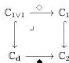
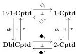
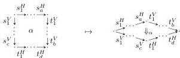
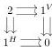

22

AARON DAVID FAIRBANKS AND MICHAEL SHULMAN

*Remark 4.9.* We have a commutative diagram (moreover, a pullback square)

where each horizontal functor is the projection of a category of elements onto its domain, and the vertical functors are the obvious inclusions (each of which, incidentally, may also be viewed as projection of a category of elements onto its domain). We thereby obtain a similar diagram of functor categories:

Here $\blacklozenge^*$, $\diamond^*$, and both functors denoted $\tau$ are restrictions ($\tau$ means “truncation”); $\blacklozenge_!$, $\diamond_!$, and both functors denoted $\mathbf{sk}$ are left Kan extensions ($\mathbf{sk}$ means “skeleton”). We have the obvious commutativities $\diamond^*\tau \cong \tau\blacklozenge^*$ and $\mathbf{sk}\diamond_! \cong \blacklozenge_!\mathbf{sk}$, and the Beck-Chevalley property also holds, giving isomorphisms $\diamond_!\tau \cong \tau\blacklozenge_!$ and $\mathbf{sk}\diamond^* \cong \blacklozenge^*\mathbf{sk}$.

Viewing the left Kan extensions as slice category projections

$$\diamond_!: 1\text{-}\mathbf{Cptd}/A \rightarrow 1\text{-}\mathbf{Cptd} \quad \text{and} \quad \blacklozenge_!: 2\text{-}\mathbf{Cptd}/B \rightarrow 2\text{-}\mathbf{Cptd}$$

we have that the right adjoints $\diamond^*$ and $\blacklozenge^*$ are respectively given by product with $A$ and $B$ (pulling back $1\text{-}\mathbf{Cptd} = 1\text{-}\mathbf{Cptd}/1$ along $A \rightarrow 1$ and $2\text{-}\mathbf{Cptd} = 2\text{-}\mathbf{Cptd}/1$ along $B \rightarrow 1$). Explicitly, $\blacklozenge^*$ sends a 2-computed to a double computed whose 2-cells of shape $2_{c,d}^{a,b}$ are the 2-cells of shape $2_{c+d}^{a+b}$ therein (a.k.a. “quintets”).

We refer to 2-cells of shapes $2_{0,1}^{1,0}$, $2_{1,0}^{0,1}$, and $2_{1,1}^{1,1}$ in a double computed respectively as **horizontal bigons**, **vertical bigons**, and **squares**. We call a double computed in which all 2-cells are squares a **double graph**. We denote this full subcategory of **DblCptd** by **DblGph**, also a functor category with domain a full subcategory of $\mathbb{C}_d$:

(composition laws as in $\mathbb{C}_d$, where $2 := 2_{1,1}^{1,1}$).