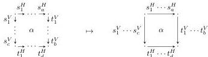

DOUBLY WEAK DOUBLE CATEGORIES

23

The category **DblGph** is also a comma category (**Set**/1∨1-**Cptd**(□, −)). Hence we additionally have a functor from **DblCptd** = (**Set**/1∨1-**Cptd**(□, $T_{1\vee 1}$ −)) to **DblGph** by applying $T_{1\vee 1}$, which reinterprets all of the 2-cells in a double computad as squares of paths.

This is more precisely a functor $\iota_{\mathbf{d}}$: **DblCptd** $\rightarrow$ 1∨1-**CatDblGph** where the codomain is double graphs equipped with 1∨1-category structure on 1-cells. Note that this category 1∨1-**CatDblGph** is evidently monadic over **DblGph**.

The functor $\iota_{\mathbf{d}}$ is pseudomonic; its image consists of double graphs equipped with *free* 1∨1-category structure and maps sending generating 1-cells to generating 1-cells. Thus double computads are equivalently such structured double graphs.

The category **DblCat** of (small, strict) double categories is also monadic over **DblGph**, essentially by definition (as a double graph equipped with various operations). The forgetful right adjoint evidently factors through an intermediate right adjoint **DblCat** $\rightarrow$ 1∨1-**CatDblGph**, which is also monadic by **Lemma 4.3**. In the next section we will see that **DblCat** is monadic over **DblCptd** as well.

## 5. ALGEBRAIC DEFINITIONS

Now we are able to describe implicit 2-categories and implicit double categories (**Sections 2 and 3**) as algebras of monads on the presheaf categories 2-**Cptd** and **DblCptd** respectively, confirming their essentially algebraic nature.

In **Section 4**, we encountered several essentially algebraic structures presented by operations and equations (such as categories, strict 2-categories, and strict double categories), and we tacitly interpreted these as monads on presheaf categories. But we will soon need presentations of monads in more general situations, so we review a general method for presenting monads, following [Lac09, §5]. (Our definitions of implicit 2-categories and implicit double categories in this section will just be presentations of monads on presheaf categories as usual, but in **Section 6** we will also be interested in presenting 2-monads on non-presheaf categories.)

Let $\mathcal{V}$ be a locally finitely presentable (l.f.p.) monoidal category whose subcategory of finitely presentable objects $\mathcal{V}_f$ is closed under the monoidal structure, so we have a good theory of l.f.p. $\mathcal{V}$-enriched categories as in [Kel82b]; we will use $\mathcal{V} = \mathbf{Set}$ and $\mathcal{V} = \mathbf{Cat}$. Let $\mathcal{K}$ be an l.f.p. $\mathcal{V}$-category. Then by [Lac99], the category $\mathbf{Mnd}_f(\mathcal{K})$ of finitary monads on $\mathcal{K}$ is monadic over the category $[\mathrm{ob}\mathcal{K}_f, \mathcal{K}]$ of families of objects of $\mathcal{K}$ indexed by the set of finitely presentable objects of $\mathcal{K}$. Thus, we can *present* such monads using free monads generated by such families and colimits in $\mathbf{Mnd}_f(\mathcal{K})$; and because these free monads and colimits are *algebraic* [Kel80], such a presentation also determines the algebras for the presented monad. Specifically, given $A \in [\mathrm{ob}\mathcal{K}_f, \mathcal{K}]$, an algebra for the free finitary monad $FA$ it generates is an object $X \in \mathcal{K}$ with a family of maps $\mathcal{K}(c, X) \rightarrow \mathcal{K}(Ac, X)$ for all $c \in \mathcal{K}_f$; and an algebra for a colimit of finitary monads is an object with a compatible family of algebra structures for those monads.