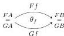
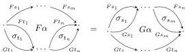

DOUBLY WEAK DOUBLE CATEGORIES

29

composition of transformations is not strictly associative. But there is an alternative notion of 2-cell will give us a 2-category after all, called an *icon* [Lac08].

When $F$ and $G$ are pseudofunctors of bicategories, an icon from $F$ to $G$ is equivalent to a *colax* transformation whose components are identity 1-cells. (A *lax* transformation from $F$ to $G$ whose components are identity 1-cells can be identified with an icon from $G$ to $F$; the reason one chooses the colax ones to be primary is that it is in that case that the 2-cell components point *from* the value of $F$ on a 1-cell *to* the value of $G$ on that 1-cell.)

We may define an icon of implicit 2-category functors to be simply an icon of the associated 2-functors between path 2-categories. Unpacking this, we get the following:

**Definition 6.1.** Let $\mathbf{C}$ and $\mathbf{D}$ be implicit 2-categories, and let $F, G: \mathbf{C} \rightarrow \mathbf{D}$ be functors *that agree on 0-cells*. An **icon** $\theta$ between $F$ and $G$ consists of, for each 1-cell $f: A \rightarrow B$ in $\mathbf{C}$, a 2-cell (bigon) $\theta_f$ in $\mathbf{D}$:

such that for each 2-cell $\alpha$ in $\mathbf{C}$, we have

We define **compositions** of icons componentwise. Likewise **identity** icons are identities componentwise. We can also **whisker** an icon with a functor (i.e. compose a functor $C' \rightarrow C$ with an icon of functors $C \rightarrow D$ to obtain an icon of functors $C' \rightarrow D$; or compose an icon of functors $C \rightarrow D$ with a functor $D \rightarrow D'$ to obtain an icon of functors $C \rightarrow D'$) by using the icon components at the image of the functor or by applying the functor to the icon components, as usual.

**Proposition 6.2.** *There is a strict 2-category $\mathcal{I}$-2-Cat of implicit 2-categories, functors, and icons.*

This is just the locally full sub-2-category of the 2-category of strict 2-categories, 2-functors, and icons in the ordinary sense.

The definition for implicit double categories is similar, but there is an added subtlety: we have to choose directions for both the horizontal and vertical component bigons, and these choices can be independent. Thus in principle we get four different notions of icon, and which one we regard as going “from” $F$ “to” $G$ depends on our beliefs about which direction the squares in a double category “point”. There are also four possibilities for this, which we may name cardinally as **northwest** $\searrow$, **northeast** $\nearrow$, **southeast** $\searrow$, and **southwest** $\nearrow$.

For the most part we will choose the *southeast* view, which has the advantage that squares point in the same direction as all the arrows on their boundaries: