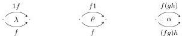
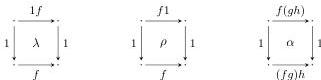

DOUBLY WEAK DOUBLE CATEGORIES

3

sometimes called *maps*). The resulting double category was used in [KS74] to formalize the functoriality of the “mates” correspondence in $\mathcal{D}$. To do the same when $\mathcal{D}$ is a bicategory would require a doubly weak double category.

- If $\mathcal{C}$ and $\mathcal{D}$ are strict 2-categories, there is a strict double category that we denote $\operatorname{Hom}_{\operatorname{co}/\operatorname{lax}}(\mathcal{C}, \mathcal{D})$ whose objects are functors $\mathcal{C} \to \mathcal{D}$, whose horizontal and vertical 1-cells are *lax* and *colax* transformations respectively, and whose 2-cells are a general notion of modification. This should also be true if $\mathcal{C}$ and $\mathcal{D}$ are bicategories, but in that case this double category would be weak in both directions.
- Similarly, if $T$ is a 2-monad on a 2-category $\mathcal{C}$, there is a strict double category whose objects are $T$-algebras and whose horizontal and vertical 1-cells are *lax* and *colax* $T$-morphisms respectively. (Such double categories were first considered by [GP04].) This should also be true if $T$ is a pseudomonad on a bicategory, but in that case this double category would again be weak in both directions.

We evidently cannot define doubly weak double categories as any sort of internal category in categories (since the arrows of a category compose strictly associatively). But we can write out the definition of a double category explicitly, with sets of 0-cells, vertical and horizontal 1-cells, and squares, and then try to insert coherence isomorphisms relating compositions of 1-cells. However, it is surprisingly tricky to make this work, for the following reason.

Note first that the usual associativity and unit constraint isomorphisms in a bicategory are *globular*:

In a pseudo double category, and presumptively in a doubly weak double category, the corresponding requirement would be that they are squares bordered by vertical identity 1-cells, simulating globular 2-cells:

In order to state the usual coherence conditions that these globular 2-cells should satisfy, we must be able to compose them. But when *vertical* composition of 1-cells is not strictly unital, vertical composition of squares takes squares that are bordered by vertical identities to squares that are not; thus the usual coherence conditions on these squares are not well-typed (the vertical boundaries of the two sides of the