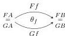
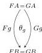
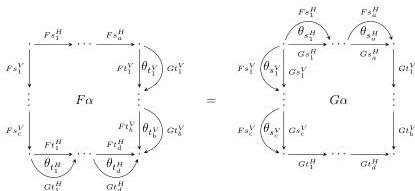

30

AARON DAVID FAIRBANKS AND MICHAEL SHULMAN

This has the consequence that horizontal bigons point from top to bottom, while vertical bigons point from left to right. However, it should be noted that this is not compatible with the “quintets” construction of a double category from a 2-category, which requires picking either the northeast or southwest view. Fortunately, the four kinds of icon are interchanged by the symmetry operations of double categories, so all of them provide equivalent 2-categories of double categories in the end. Moreover, *invertible* icons are the same no matter which definition we pick.

**Definition 6.3.** Let $F, G: \mathbf{C} \rightarrow \mathbf{D}$ be functors of implicit double categories *that agree on 0-cells*. A **southeast icon** $\theta$ between $F$ and $G$ consists of

- for each horizontal $f: A \rightarrow B$ in $\mathbf{C}$, a 2-cell (horizontal bigon) $\theta_f$ in $\mathbf{D}$:

- for each vertical $g: A \rightarrow B$ in $\mathbf{C}$, a 2-cell (vertical bigon) $\theta_g$ in $\mathbf{D}$:

such that for each 2-cell $\alpha$ in $\mathbf{C}$, we have

**Proposition 6.4.** *There is a strict 2-category $\mathcal{IDblCat}$ of implicit double categories, functors, and (southeast) icons.*

Now since $\mathcal{I}$-2-Cat and $\mathcal{IDblCat}$ are 2-categories, we can hope to enhance the monads on these categories to 2-monads. This is not possible for our monads on 2-Cptd and DblCptd, as these are not 2-categories in any obvious way.

**Remark 6.5.** There is also another category between I-2-Cat and 2-Cptd that can be extended to a 2-category: its objects are 2-computads equipped with composition operations allowing arbitrary 2-cells to be composed only with bigons. (In other words, the bigons form categories which compatibly act on other 2-cells.) The