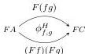
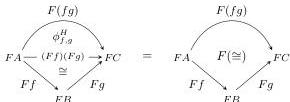
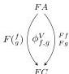
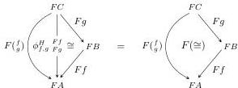
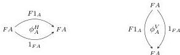

32

AARON DAVID FAIRBANKS AND MICHAEL SHULMAN

Similarly, if $T$ is the coequalizer of the maps $FB \Rightarrow FA$, a pseudo $T$-morphism is a pseudo $FA$-morphism (as above) that restricts to the same pseudo $FB$-morphism along the two given maps. In our case, this specializes to the following:

**Lemma 6.7.** *Let $\mathbf{C}$ and $\mathbf{D}$ be doubly weak double categories. A pseudo $T^\mathbf{v}$-morphism $F: \mathbf{C} \rightarrow \mathbf{D}$ is a functor of implicit double categories together with*

- *For each pair of composable horizontal 1-cells $f: A \rightarrow B$ and $g: B \rightarrow C$ in $\mathbf{C}$, an invertible horizontal bigon in $\mathbf{D}$:*

*that commutes with the representability isomorphisms:*

- *For each pair of composable vertical 1-cells $f: A \rightarrow B$ and $g: B \rightarrow C$ in $\mathbf{C}$, an invertible vertical bigon in $\mathbf{D}$:*

*that commutes with the representability isomorphisms:*

- *For each object $A \in \mathbf{C}$, invertible horizontal and vertical bigons:*

