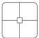
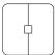
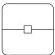
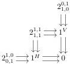
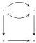
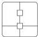

DOUBLY WEAK DOUBLE CATEGORIES

35

A double graph with bigons is a double computed whose only 2-cells are squares, horizontal bigons, and vertical bigons:

and

and

The category BiDblGph of double graphs with bigons can be identified with a functor category whose domain is a suitable full subcategory of  \( C_{d} \) :

(composition laws as in \(\mathbb{C}_{\mathbf{d}}\)). Hence the forgetful functor \(\mathbf{DblCptd} \to \mathbf{DblGph}\) factors through \(\mathbf{BiDblGph}\).

We now recall the definition of double bicategory, writing out all the operations explicitly for reference.

Definition 7.1 ([Ver92]). A double bicategory consists of:

- A double graph with bigons. (That is, collections of 0-cells, horizontal and vertical 1-cells, and horizontal bigon 2-cells, vertical bigon 2-cells, and square 2-cells, related appropriately by various source and target maps.)
- The operations of a bicategory on the horizontal 1-cells and bigons. Likewise, the operations of a bicategory on the vertical 1-cells and bigons.
- A top bigon-on-square action operation sending compatible pairs of horizontal bigons and squares (where the bottom 1-cell of the bigon is the same as the top 1-cell of the square) to squares.

Likewise bottom, left, and right bigon-on-square action operations.

- A horizontal identity square operation sending vertical 1-cells to squares. Likewise, a vertical identity square operation sending horizontal 1-cells to squares.
- A horizontal composition operation sending compatible pairs of squares (where the right 1-cell of the first square is the same as the left 1-cell of the second square) to squares.

Likewise, a vertical composition operation for squares.

Furthermore, the following laws hold:

- Appropriate source and target laws for all ways of composing bigons and squares.
- The laws of a bicategory for horizontal 1-cells and bigons, and likewise for vertical 1-cells and bigons.