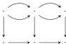
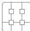
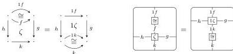

36

AARON DAVID FAIRBANKS AND MICHAEL SHULMAN

- Identity, associativity, and mutual commutativity laws making the left, right, top, and bottom bigon-on-square operations into four compatible actions.
- For any vertical bigon $\beta$, the identity square commutativity law

$$\beta 1 = 1\beta$$

(where the left hand side is the left action of $\beta$ on the identity square of its codomain, and the right hand side is the right action of $\beta$ on the identity square of its domain).

Likewise, the analogous identity square commutativity law for horizontal bigons.

- For any compatible horizontal string consisting of a vertical bigon $\beta$ sandwiched between two squares $\zeta, \xi$, the associativity law

$$(\zeta\beta)\xi = \zeta(\beta\xi).$$

Likewise, the analogous vertical sandwiching associativity law.

- For any compatible horizontal string consisting of a vertical bigon $\beta$ to the left of two squares $\zeta, \xi$, the associativity law

$$(\beta\zeta)\xi = \beta(\zeta\xi).$$

Likewise, the analogous horizontal associativity law on the right, and the analogous vertical associativity laws on the top and bottom.

- An interchange law that says the two possible ways of composing two horizontal bigons side by side atop two horizontally adjacent squares are equal.

Likewise, the analogous interchange laws for horizontal bigons below horizontally adjacent squares, and for vertical bigons to the left and to the right of vertically stacked squares.

- A horizontal left unitor naturality law for squares $\zeta$:

where $\cong$ denotes the appropriate left unitor isomorphism bigons.

Likewise, the analogous horizontal right unitor naturality law, and the analogous top and bottom (i.e. vertical left and right) unitor naturality laws.