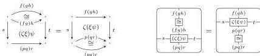
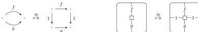

DOUBLY WEAK DOUBLE CATEGORIES

37

- A horizontal associator naturality law for squares $\zeta, \xi, \psi$:

where $\cong$ denotes the appropriate associator isomorphism bigons.

Likewise, the analogous vertical associator naturality law.

- The interchange laws for squares as in a double category.
Specifically, the identity compatibility law states that vertical identity squares on horizontal identity 1-cells agree with horizontal identity squares on vertical 1-cells; the identity interchange laws state that horizontal compositions of vertical identity squares are vertical identity squares and vice versa; and the square composition interchange law states that the two possible ways of composing a two by two grid of compatible squares are equal.

We will show that doubly weak double categories are equivalent to double bicategories satisfying an extra “tidiness” condition.

**Definition 7.2.** A **tidy double bicategory** is a double bicategory in which the canonical map that sends *2-cells in the horizontal bicategory* to *squares whose vertical source and target are identities* is bijective

and analogously for 2-cells in the vertical bicategory and squares whose horizontal source and target are identities.

Explicitly, this means a tidy double bicategory has:

- A conversion operation sending squares whose top and bottom 1-cells are identities to vertical bigons.
Likewise, a conversion operation sending squares whose left and right 1-cells are identities to horizontal bigons.
and the following laws are satisfied:
- Appropriate source and target laws for the degenerate square to bigon conversion operations.
- The horizontally degenerate square to vertical bigon conversion operation is inverse to the map that sends each vertical bigon $\beta$ to the square

$$\beta 1 = 1\beta.$$

Likewise, the analogous correspondence holds between vertically degenerate squares and horizontal bigons.

**Remark 7.3.** Tidiness already appears, without a name, in [Ver92, Lemma 1.4.9]. In [RvdWAN25] it is called *saturation*.