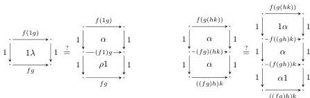
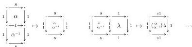

4

AARON DAVID FAIRBANKS AND MICHAEL SHULMAN

equation are not equal).

We might try to correct this by horizontally composing with vertical unitors, but this in turn affects the bordering horizontal 1-cells; and so on, *ad infinitum*. For instance, we cannot even compose a putative isomorphism $\alpha$ with its putative inverse and other coherence cells to yield an identity on the source or target:

At least two ways around this problem have been proposed to date.

- In [Ver92] Verity defined a *double bicategory* to consist of horizontal and vertical bicategories with the same set of objects, together with sets of squares that are acted on by the 2-cells of the bicategories and can be composed with each other horizontally and vertically.

This includes the important examples, but it does not quite capture all their structure, since nothing in a double bicategory allows us to identify the 2-cells in the horizontal and vertical bicategories with the squares bordered by identities, whereas in examples these two are always the same.

It is possible to correct this problem by assuming an additional axiom. This axiom was already mentioned by Verity [Ver92, Lemma 1.4.9], and was called “saturation” in [RvdWAN25]. We will discuss this further in Sections 1.3 and 7.

- In [Gar10a] Garner proposed a definition of *cubical bicategory* that consists of the data of a double category (objects, horizontal and vertical 1-cells, and squares) with 1-cell composition and identities (satisfying no axioms), plus a way to compose any grid of squares along any way of composing up its boundaries, satisfying appropriate coherence axioms.

This also describes the important examples, but also does not capture all of their structure. In particular, with this definition there is no obvious way to extract (say) a horizontal bicategory consisting of objects, horizontal arrows, and squares bordered by vertical identities.

In this paper we propose a new definition of doubly weak double category, which is closely related to the above approaches but is not subject to either of their problems. We will show that our doubly weak double categories are equivalent to