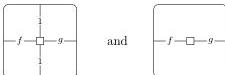
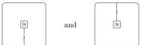
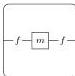

DOUBLY WEAK DOUBLE CATEGORIES

41

Using Corollary 5.7, to see this it suffices to give a similar description of free strict double categories, where the 1-cells are instead simply paths. Such bigon-accessorized grids indeed form a strict double category (where 2-cells bordered by identities are given by zero-width or zero-height grids), and we may check its universal property. Namely, given a double graph with bigons $X$, a strict double category $\mathbf{C}$, and a map $X \rightarrow U\mathbf{C}$ (where $U\mathbf{C}$ is the underlying double graph with bigons of $\mathbf{C}$), there is a unique extension to a strict double functor from the free strict double category $FX \rightarrow \mathbf{C}$. Each 2-cell in $FX$ may be composed from the generators $X$, for example by horizontally composing the rows consisting of squares and vertical bigons; horizontally composing (whiskering) horizontal 1-cells and vertical compositions of horizontal bigons between the rows; and finally vertically composing all these horizontal composites. Hence we obtain a map $FX \rightarrow \mathbf{C}$ sending cells in $FX$ to the corresponding composites in $\mathbf{C}$. Functoriality is shown using the associativity and interchange laws.

Now by Proposition 7.10, in order to see that the two monads on **BiDblGph** agree, it is enough to see that the underlying bicategories of a free double bicategory and those of a free doubly weak double category both constitute the free bicategories on the underlying 2-graphs. For double bicategories this is clear because the only operations giving bigons are the bicategory operations; for doubly weak double categories this follows from the description in the previous paragraph (and the similar description of free bicategories on 2-graphs). $\square$

**Proposition 7.20.** *The forgetful functor $\mathbf{WDblCat}_{\mathbf{st}} \rightarrow \mathbf{BiDblGph}$ is not monadic. (That is to say, doubly weak double categories are distinct from double bicategories.)*

*Proof.* By Lemma 7.19, it suffices to exhibit a double bicategory that does not arise from any doubly weak double category. In a doubly weak double category, there is a bijection between 2-cells of shapes

obtained by composing on the top and bottom with the isomorphisms

We now construct a double bicategory without this property. Given any monoid $M$, let the double bicategory $\mathcal{C}_M$ have two 0-cells $A$ and $B$, one nonidentity vertical 1-cell $f: A \rightarrow B$, a vertical bigon

