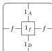
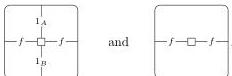
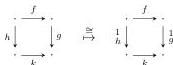

42

AARON DAVID FAIRBANKS AND MICHAEL SHULMAN

for each $m \in M$, no nonidentity horizontal arrows or bigons, and no nonidentity squares. The only square that the nontrivial vertical bigons can act on is the identity square

and we can simply say that it is fixed by this action. Thus, if $M$ is nontrivial, then in $\mathcal{C}_M$ there is no bijection between 2-cells of shapes

Hence $\mathcal{C}_M$ cannot arise from any doubly weak double category.

*Remark 7.21.* Given Lemma 7.19, the functor $\mathbf{WDblCat}_{\mathbf{st}} \rightarrow \mathbf{DblBicat}_{\mathbf{st}}$ is the canonical comparison functor to the category of algebras for the induced monad on $\mathbf{BiDblGph}$. When such a comparison functor is fully faithful (as it is in this case, by Corollary 7.11), the right adjoint forgetful functor (here $\mathbf{WDblCat}_{\mathbf{st}} \rightarrow \mathbf{BiDblGph}$) is said to be of *descent type* [BW05] or *premonadic* [Tho74]. There are many other equivalent characterizations of this property, which are summarized in [KP93, Theorem 2.4]; perhaps the most interesting is that *every doubly weak double category has a canonical presentation as a coequalizer of maps between doubly weak double categories that are freely generated by double graphs with bigons*.

The definition of tidy double bicategory is convenient because it is finite. However, it still contains redundancies that can be eliminated. If we pare it down to the bones, we obtain our most concise definition of doubly weak double category.

**Proposition 7.22.** *A doubly weak double category amounts to:*

- *a double graph,*
- *horizontal and vertical 1-cell composition and identity operations (as in a double category),*
- *horizontal and vertical square composition and identity operations (as in a double category), and*
- *horizontal and vertical associator and unitor squares (and their putative inverses) with identity 1-cells as their vertical and horizontal boundaries, respectively,*

*with appropriate sources and targets, such that*

- *the canonical map induced by composing with an identity square (in any of the four directions)*

