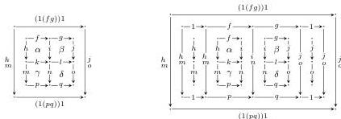

44

AARON DAVID FAIRBANKS AND MICHAEL SHULMAN

### 8. CUBICAL BICATEGORIES

Next, we compare our definition of doubly weak double category with Garner's definition of cubical bicategory, which he described as follows [Gar10a]:

Definition. A cubical bicategory is given by sets of objects, of vertical arrows, of horizontal arrows and of squares, satisfying the obvious source and target criteria, together with operations of identity and binary composition for vertical and horizontal arrows, satisfying no laws at all; and finally, for every $n \times m$ grid of squares (where possibly $n$ or $m$ are zero), and every way of composing up the horizontal and vertical boundaries using the nullary and binary compositions, a composite square with those boundaries. The coherence axioms which this structure must satisfy say that any two ways of composing up a diagram of squares must give the same answer.

Just like Verity's definition, Garner's definition can be derived from ours by ignoring some of the structure of a double computad. But first, let us elaborate on the subtler points of this definition.

The condition that 'any two ways of composing up a diagram of squares must give the same answer' a priori constitutes infinitely many axioms involving grids of squares nested arbitrarily deeply. In particular, we have infinitely many axioms involving arbitrarily many $n \times 0$ and $0 \times m$ grids nested within other grids. For example, all of the following composites are made equal, since they represent the same formal $2 \times 2$ grid of squares:

