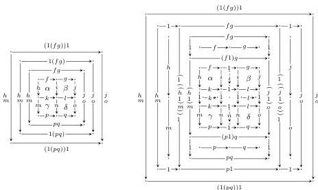
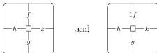
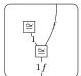

DOUBLY WEAK DOUBLE CATEGORIES

45

To put it another way, equality between composite squares in the free cubical bicategory on a double graph is checked by comparing the boundaries and the induced grids of generating squares appearing in the composites. This leads to the following observation.

Recall that **DblGph** denotes the category of double graphs.

**Lemma 8.1.** *The algebras of the monad on DblGph induced by the forgetful functor $\mathbf{WDblCat}_{\mathbf{st}} \rightarrow \mathbf{DblGph}$ are precisely cubical bicategories.*

*Proof.* The above definition is obtained from the characterization in **Corollary 5.7** of the free doubly weak double category on a double computed, specialized to the case of double graphs. (The 2-cells in free *strict* double categories on double graphs are given by grids of squares; this is well-known and also follows as a special case of the description of free strict double categories in the proof of **Lemma 7.19**.) □

**Proposition 8.2.** *The forgetful functor $\mathbf{WDblCat}_{\mathbf{st}} \rightarrow \mathbf{DblGph}$ is not monadic. (That is to say, doubly weak double categories are distinct from cubical bicategories.)*

*Proof.* By **Lemma 8.1**, it suffices to exhibit a cubical bicategory that does not arise from any doubly weak double category. In a doubly weak double category, there is a bijection between 2-cells of shapes

obtained by composing on the top with the unitor isomorphism

