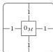
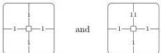
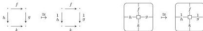

46

AARON DAVID FAIRBANKS AND MICHAEL SHULMAN

We now construct a cubical bicategory without this property. Given any commutative monoid $M$ with identity $0_M$, let the cubical bicategory $\mathbf{C}_M$ have one 0-cell, and let the horizontal and vertical 1-cells both be freely generated, i.e. given by bracketed strings of 1. Let there be one 2-cell bordered on all sides by 1, which we label $0_M$

and let the 2-cells having any other particular boundary be identified with $M$. The composite of any grid of 2-cells will be given by simply adding up the elements of $M$ occurring in it.

Now if $M$ is nontrivial, then in $\mathbf{C}_M$ there is no bijection between 2-cells of shapes

Hence $\mathbf{C}_M$ cannot arise from any doubly weak double category. $\square$

However, Lemma 8.1 does also give us:

**Corollary 8.3.** *There is a canonical functor from doubly weak double categories to cubical bicategories.*

*Proof.* This is the standard comparison functor from the domain of any right adjoint to the category of algebras for the monad induced by the adjunction. $\square$

We now show that, as was the case for double bicategories, this comparison functor is fully faithful, and we characterize the image. (It is possible to quickly see that the comparison functor is fully faithful using Proposition 7.22, but it will take us some additional work to establish the following simple characterization of the image.)

**Definition 8.4.** A **tidy cubical bicategory** is a cubical bicategory such that the canonical map induced by composing with an identity square (in any of the four directions)

is a bijection, per boundary. In terms of operations and laws, this means a tidy cubical bicategory is additionally equipped with four conversion operations, defined