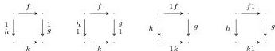
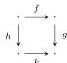
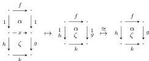

DOUBLY WEAK DOUBLE CATEGORIES

47

on squares of forms

satisfying laws that ensure these are sent to squares of the form

and that these operations are inverse to composing with identities.

**Proposition 8.5.** *The comparison functor of Corollary 8.3 is an equivalence onto the full subcategory of tidy cubical bicategories.*

*Proof.* Suppose given a tidy cubical bicategory. We will construct a tidy double bicategory using the squares-only definition from Proposition 7.22. That is, we require a double graph equipped with binary composition and identity operations, such that the canonical maps induced by composing with identities are bijections per boundary, and the squares and “bigons” (squares bordered appropriately by identities) with the induced operations have the structure of a double bicategory.

Any cubical bicategory has an underlying double graph with binary composition operations and identities (among other more general composition operations). In particular, an identity square for (say) vertical composition is obtained by composing a $0 \times 1$ grid using single identity 1-cells as the composites of the nullary left and right boundaries. A *tidy* cubical bicategory moreover by definition has the same identity square cancellation condition of Proposition 7.22.

As in Proposition 7.22, we define horizontal (vertical) bigons to be squares bordered by vertical (horizontal) identity 1-cells, and we define the bigon-on-square and bigon-on-bigon composition operations of a double bicategory by composing squares then applying the given identity square cancellation bijection. We display this again here for convenience:

Now we observe that the structure of a cubical bicategory does contain coherence 2-cells bounded by identities, as in the structure of a double bicategory. Any sequence of (say) horizontal 1-cells

$$\cdot \xrightarrow{f_1} \cdot \xrightarrow{f_2} \dots \xrightarrow{f_{n-1}} \cdot \xrightarrow{f_n} \cdot$$

can be regarded as a $0 \times n$ grid of composable squares. Therefore, given any two ways of bracketing a composite of these 1-cells (perhaps including insertion of identities), we can take those to be the top and bottom composites for this grid,