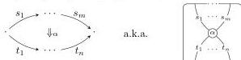
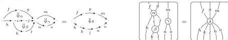

DOUBLY WEAK DOUBLE CATEGORIES

5

double bicategories satisfying the “saturation” condition (which we call “tidiness”), and also to cubical bicategories satisfying an analogous condition. Furthermore, from a certain perspective, our doubly weak double categories are simply the double-categorical analogue of bicategories, as we will explain next.

1.2. **Implicit structures.** Bicategories are typically regarded as more complicated than strict 2-categories. But from another point of view, bicategories are simpler than strict 2-categories. Roughly, a bicategory is like a strict 2-category but *without* equalities between compositions of 1-cells.

From this perspective, just like a group has “fewer ingredients” than a ring, a bicategory has “fewer ingredients” than a strict 2-category. In particular, when a definition of a 2-categorical shape (e.g. the shape of an adjunction, a monad, or a module) makes no reference to equality between compositions of 1-cells, it actually belongs in the more general setting of bicategories.

Let us make this more precise. We start with a **2-computad** (introduced by Street in [Str76]²), a “2-category without composition”. Explicitly, this consists of

- a collection of 0-cells,
- a collection of 1-cells, each with a source and a target 0-cell, and
- a collection of 2-cells, each with a source and a target string of 1-cells (where these 1-cells match along 0-cells as appropriate).

A 2-computad is the sort of structure that generates a free 2-category, just as a directed graph (a.k.a. 1-computad, a “category without composition”) is the sort of structure that generates a free category; indeed, Street observed in [Str76] that 2-categories are monadic over 2-computads. We can draw a 2-cell either as a pasting diagram or a string diagram (the topological dual):

There is also an intermediate notion between a 2-computad and a 2-category: a structure in which the 2-cells can be composed, but the 1-cells cannot. We call this essentially algebraic structure an **implicit 2-category**. It consists of

- a 2-computad,
- 2-cell composition and identity operations (horizontal and vertical), and
- associativity, unit, and interchange laws.

In other words, it has 0-cells, 1-cells, 2-cells with composition, and equalities between compositions of 2-cells. The compositions of 2-cells can be drawn for example as follows:

²Street’s computads were later generalized to n- and ∞-computads by Burroni [Bur93] (who introduced them independently, calling them *polygraphs*), Batanin [Bat98, Bat02], and Makkai [HMZ08].