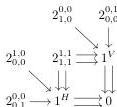

DOUBLY WEAK DOUBLE CATEGORIES

51

structure. Conversely, all the structure of a tidy cubical bicategory is determined by the underlying tidy double category structure, since an arbitrary grid composition operation is obtained by binarily composing the grid and acting with coherence isomorphism bigons to rebracket the boundary as desired. □

**Corollary 8.6.** *The forgetful functor from doubly weak double categories to cubical bicategories is fully faithful.* □

**Corollary 8.7.** *The forgetful functor $\mathbf{WDblCat}_{\text{st}} \rightarrow \mathbf{DblGph}$ is faithful and conservative.* □

Thus we can still regard a doubly weak double category as “structure” on an underlying double graph, though that structure is not monadic.

*Remark 8.8.* Similarly to *Remark 7.21*, Corollary 8.6 says that the forgetful functor $\mathbf{WDblCat} \rightarrow \mathbf{DblGph}$ is of descent type or premonadic, and this implies that every doubly weak double category has a canonical presentation as a coequalizer of maps between doubly weak double categories that are freely generated by double graphs.

## 9. A FINITE AXIOMATIZATION

Tidy double bicategories do constitute a finite axiomatization of doubly weak double categories: they are essentially algebraic (presenting a finite limit theory) with finitely many types, finitely many operations, and finitely many equations.

However, they do not share the good property of the infinitary definition in Section 5 of being presented as monadic over a presheaf category in which *pseudofunctors* can also be represented as presheaf maps. (A tidy double bicategory requires operations whose domains involve identity 1-cells; however, identity 1-cells are not strictly preserved by pseudofunctors.)

We now present another finitary definition, exhibiting doubly weak double categories as monadic over a presheaf category with domain a finite subcategory of that of double computads. The practical use of this particular presentation is questionable, but the point is to illustrate that something like it can be done. There are many axioms, but most of them are adaptations of the axioms for double bicategories.

A **monogon** in a double computad is a 2-cell of shape $2_{0,0}^{1,0}$, $2_{0,0}^{0,1}$, $2_{1,0}^{0,0}$, or $2_{0,1}^{0,0}$. A **double graph with monogons** is a double computad in which all 2-cells are monogons or squares. Let $\mathbf{MoDblGph}$ denote the category of double graphs with monogons, a functor category whose domain is a suitable full subcategory of $\mathbb{C}_d$:

**Definition 9.1.** A **weak composition structure** on a double graph with monogons consists of the following operations.