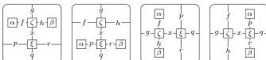
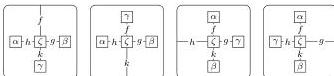
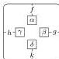
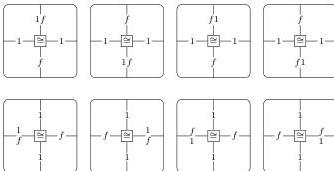
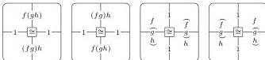

52

AARON DAVID FAIRBANKS AND MICHAEL SHULMAN

- Horizontal and vertical binary composition and identity operations for 1-cells and squares, as in a double bicategory.
- Four 2-cell composition operations sending two compatible squares and two compatible monogons to a square:

- Four 2-cell composition operations sending a square and three compatible monogons to a monogon:

- A 2-cell composition operation sending four compatible monogons (one of each type) to a square:

- Operations sending horizontal 1-cells to left and right unitor squares and their inverses, and likewise for vertical 1-cells:

- Operations sending length three paths of horizontal 1-cells to associator squares and their inverses, and likewise for vertical 1-cells:

