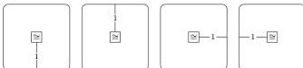
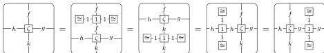
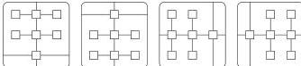
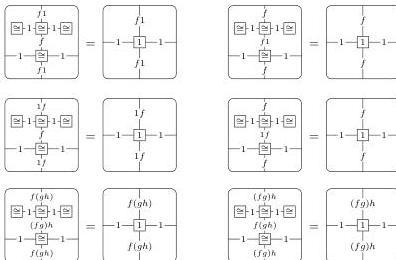

DOUBLY WEAK DOUBLE CATEGORIES

53

- Operations sending 0-cells to horizontal and vertical identity composition monogons and their inverses:

Moreover, these operations must satisfy the following laws.

- Source and target laws for horizontal and vertical identity and binary composition operations of 1-cells and squares, as in a double bicategory.
- Source and target laws for unitor and associator squares, 2-cell composition operations, and identity composition monogons, as appropriate.
- Identity laws:

- Associativity laws that say the three possible ways of composing each of the following diagram shapes are equal:

- Horizontal unitor and associator invertibility laws:

Likewise, analogous laws for vertical unitors and associators.