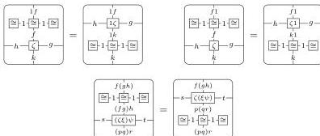
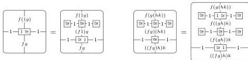
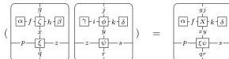
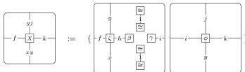

54

AARON DAVID FAIRBANKS AND MICHAEL SHULMAN

- Horizontal unitor and associator naturality laws:

Likewise, analogous laws for vertical unitors and associators.

- Horizontal bicategory triangle and pentagon laws:

(By the associativity laws above, we can use any of the three possible ways to compose the right hand side of the pentagon equation. Here and elsewhere we do not annotate how each diagram is built up from the basic composition operations, trusting the reader to compose the diagrams up in a suitable way.)

Likewise, analogous vertical bicategory pentagon and triangle laws.

- The square interchange laws as in a double category (the identity compatibility law, the identity interchange laws, and the square composition interchange law).
- Interchange laws involving monogons and horizontal composition of squares:

where

Likewise, the three other analogous (rotated) interchange laws.