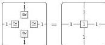
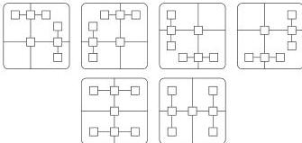
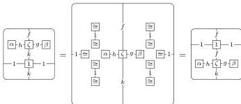
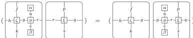
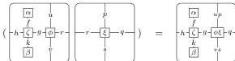

DOUBLY WEAK DOUBLE CATEGORIES

55

- A law ensuring that identity composition monogons correspond to identities:

- Associativity laws that say the two possible ways of composing each of the following diagram shapes are equal:

- Identity commutativity laws:

(By the associativity laws above, we can use either of the two possible ways to compose the middle diagram.)

Likewise, analogous (rotated) laws for horizontal identities.

- Associativity laws for sandwiching monogons between squares:

Likewise, the other analogous (rotated) associativity law for vertical composition.

- Associativity laws for squares composed beside monogons:

