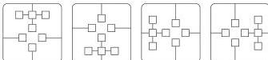
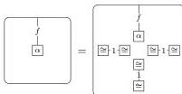
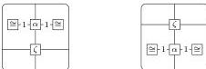
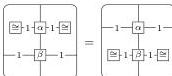

56

AARON DAVID FAIRBANKS AND MICHAEL SHULMAN

Likewise, the three other analogous (rotated) associativity laws.

- Associativity laws that say the two possible ways of composing each of the following diagram shapes are equal:

- Laws ensuring that the canonical map from monogons to squares is undone by the canonical map from appropriately degenerate squares to monogons:

Likewise, three other analogous (rotated) laws.

Any doubly weak double category has an underlying double graph with monogons, equipped with weak composition structure. Conversely, we have the following.

**Proposition 9.2.** *Any double graph with monogons having a weak composition structure $\mathbf{X}$ has an underlying tidy double bicategory:*

- *The 0-cells, 1-cells, squares, 1-cell identities and composition, and square identities and composition are as in $\mathbf{X}$.*
- *The horizontal bigons are the squares in $\mathbf{X}$ bordered by vertical identities. The vertical bigons are the squares in $\mathbf{X}$ bordered by horizontal identities.*
- *Horizontal composition of horizontal bigons, horizontal unitors, and horizontal associators are as in $\mathbf{X}$. The top and bottom actions of horizontal bigons $\alpha$ on squares $\zeta$ are defined as*

*and vertical composition of bigons $\alpha$ and $\beta$ is defined as*

*Similarly for the vertical bicategory.*