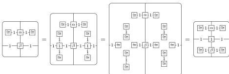
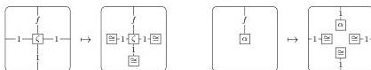
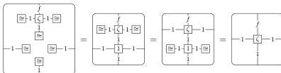

DOUBLY WEAK DOUBLE CATEGORIES

57

*Proof.* Notice that the two ways of defining vertical composition of bigons do in fact agree, using identity laws, identity composition monogons, and identity commutativity:

The interchange laws for the bicategories and for the bigon-on-square actions come straightforwardly from the monogon interchange laws, identity composition monogon law, and identity laws.

All other laws of a double bicategory correspond directly to laws of weak composition structure. $\square$

**Proposition 9.3.** *The category of double graphs with monogons equipped with weak composition structure (and homomorphisms) is equivalent to the category of doubly weak double categories (and strict functors) **WDblCat$_{st}$.***

*Proof.* First, observe that the canonical maps between squares bordered by identities on three sides and monogons

are inverse:

(with the other direction stipulated as a law in the definition).