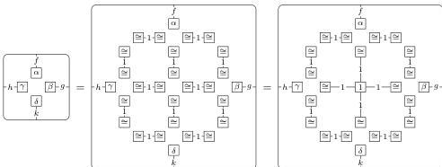
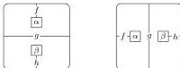

58

AARON DAVID FAIRBANKS AND MICHAEL SHULMAN

Now all of the operations are determined by the double bicategory structure. Indeed, we have

and

The right hand sides can be interpreted in the tidy double bicategory. It follows that so can

**Corollary 9.4.** *The forgetful functor* $\mathbf{WDblCat}_{\mathbf{st}} \rightarrow \mathbf{MoDblGph}$ *is monadic.*

*Remark 9.5.* Alternatively, the 4-ary monogon to square operation could be replaced without difficulty by two operations that send two monogons and a compatible 1-cell to a square:

