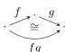
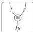
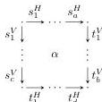
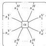

6

AARON DAVID FAIRBANKS AND MICHAEL SHULMAN

Equivalently, an implicit 2-category can be defined as a *strict* 2-category whose underlying 1-category is freely generated; the 1-cells of the implicit 2-category then being the *generating* 1-cells of this free category.

An implicit 2-category is already quite close to a bicategory, but one more detail is required. An implicit 2-category is called **representable**$^{3}$ if each string of compatible 1-cells is isomorphic to a single 1-cell. (It is sufficient to require this for binary and nullary strings.) This allows the 1-cells to be “composed”, where a “composite” 1-cell is defined up to isomorphism only.

In Section 2 we will show that the category of bicategories and pseudofunctors is equivalent to that of representable implicit 2-categories and implicit 2-category functors (homomorphisms of the essentially algebraic structure). This alternative definition of bicategory is appealing for several reasons. First of all, there are no coherence axioms. Secondly, there is no extraneous structure present that is not respected by isomorphism of bicategories; it is not possible to even express equality between compositions of 1-cells, which is conceptually clarifying.

Having considered the situation for 2-categories, we proceed to treat double categories in just the same way. A **double computad** is the sort of structure that generates a free double category: it has 0-cells, horizontal and vertical 1-cells, and 2-cells bordered by strings of compatible 1-cells. We can draw 2-cells in a double computad either as pasting diagrams or string diagrams (string diagrams for double categories are discussed in [Mye16]):

a.k.a.

An **implicit double category** is then a double computad with composition operations on 2-cells like in a double category, but *without* any composition of 1-cells (neither horizontal nor vertical). We can then define a **doubly weak double category** to be an implicit double category that is representable, i.e. every string of compatible 1-cells (horizontal or vertical) has a composite. Thus defined, doubly weak double categories are the algebras for a finitary monad on double computads.

*Remark 1.1.* Implicit structures are related to the *virtual* structures of [CS10] (generalized multicategories). For instance, a *virtual 2-category* is like an implicit 2-category but requires the targets of all 2-cells to be length-1 paths (and restricts compositions to those that preserve this property). A *virtual double category* likewise restricts the lower boundaries of 2-cells to be length-1 paths, but as with pseudo double categories, the vertical 1-cells compose strictly, breaking the horizontal/vertical symmetry.

$^{3}$This usage of “representable” traces back to the representable multicategories of [Her00].