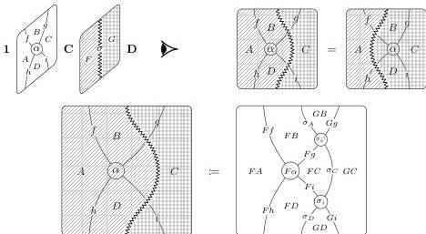

60

AARON DAVID FAIRBANKS AND MICHAEL SHULMAN

(we have no examples). Still, all of the definitions in this section readily generalize to double-categorical analogues.

To figure out what the content of $\operatorname{Hom}(\mathbf{C}, \mathbf{D})$ ought to be, recall the defining property of an internal hom: it is universal such that $\mathbf{C} \otimes \operatorname{Hom}(\mathbf{C}, \mathbf{D})$ maps into $\mathbf{D}$. However, this leaves us to wonder what the monoidal product $\otimes$ ought to be. In ordinary 2-category theory, the relevant monoidal product is the *Gray tensor product* [Gra74], which composes 2-categories as if they were the homs in a semistrict tricategory (so that closure for $\otimes$ induces a semistrict tricategory of 2-categories).

This composition can be represented very cleanly using string diagrams, as described in [Mor22]. Namely, a string diagram for $\mathbf{C} \otimes \mathbf{D}$ consists of a string diagram for $\mathbf{C}$ superimposed over a string diagram for $\mathbf{D}$. For example, diagrams in $\mathbf{C} \cong \operatorname{Hom}(\mathbf{1}, \mathbf{C})$ can be composed with diagrams in $\operatorname{Hom}(\mathbf{C}, \mathbf{D})$ to yield diagrams in $\mathbf{D} \cong \operatorname{Hom}(\mathbf{1}, \mathbf{D})$:

The Gray tensor product is easy to express in terms of implicit structures. Recall that a **shuffle** of linearly ordered sets is a compatible linear order on their disjoint union.

**Definition A.1.** Let $\mathbf{C}$ and $\mathbf{D}$ be implicit 2-categories. The **Gray tensor product** of $\mathbf{C}$ and $\mathbf{D}$, denoted $\mathbf{C} \otimes \mathbf{D}$, is an implicit 2-category defined as follows.

- A 0-cell in $\mathbf{C} \otimes \mathbf{D}$ is a pair $(c, d)$ of a 0-cell $c$ in $\mathbf{C}$ and a 0-cell $d$ in $\mathbf{D}$.
- A 1-cell in $\mathbf{C} \otimes \mathbf{D}$ is *either*
  - a pair $(f, d): (c, d) \rightarrow (c', d)$ of a 1-cell $f: c \rightarrow c'$ in $\mathbf{C}$ and a 1-cell $d$ in $\mathbf{D}$, *or*
  - a pair $(c, g): (c, d) \rightarrow (c, d')$ of a 0-cell $c$ in $\mathbf{C}$ and a 1-cell $g: d \rightarrow d'$ in $\mathbf{D}$.
  Equivalently, a path of 1-cells in $\mathbf{C} \otimes \mathbf{D}$ is a *shuffle* of a path of 1-cells in $\mathbf{C}$ and a path of 1-cells in $\mathbf{D}$.
- A 2-cell in $\mathbf{C} \otimes \mathbf{D}$, with source and target each a shuffle of a path in $\mathbf{C}$ and a path in $\mathbf{D}$, is a pair $(\alpha, \beta)$ of a 2-cell $\alpha$ with the source and target paths in $\mathbf{C}$ and a 2-cell $\beta$ with the source and target paths in $\mathbf{D}$.
- Composition of 2-cells is by composition in $\mathbf{C}$ and $\mathbf{D}$.