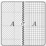
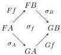
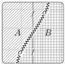

DOUBLY WEAK DOUBLE CATEGORIES

61

We also define \(\otimes\) on functors in the obvious way: if \(F\colon \mathbf{C}\to \mathbf{D}\) and \(G\colon \mathbf{C}'\to \mathbf{D}'\) are functors of implicit 2-categories, then \(F\otimes G\) sends each cell called \((x,y)\) to the cell called \((F(x),G(y))\) with appropriate boundary.

Remark A.2. This is the usual Gray tensor product of strict 2-categories, specialized to implicit 2-categories (i.e. the path 2-category of the Gray tensor product of implicit 2-categories is the usual Gray tensor product of their path 2-categories). The description of the 2-cells given here follows from the equivalence (see e.g. [Gur13, Corollary 3.22]) between the Gray tensor product of 2-categories \(\mathbf{C} \otimes \mathbf{D}\) and the cartesian product of 2-categories \(\mathbf{C} \times \mathbf{D}\).

Remark A.3. The above definition easily generalizes from a binary product to an n-ary product, by replacing pairs and binary shuffles with n-tuples and n-ary shuffles. In particular, observe that the empty Gray tensor product defined in this way is an implicit 2-category with one 0-cell denoted () and no other non-identity cells.

Proposition A.4. I-2-Cat is symmetric monoidal with respect to \(\otimes\).

Sketch of proof. Functoriality of  \( \otimes \)  is immediate from the definition. Moreover,  \( \otimes \)  is associative, unital (Remark A.3), and symmetric up to coherent natural isomorphism, by reparenthesizing and reordering the names of tuples. ☐

In Section 2 we defined an implicit 2-category as a strict 2-category whose 1-cells are free, and we defined a functor of implicit 2-categories as a 2-functor sending the generating 1-cells to generating 1-cells. Now we define a (lax or colax) transformation of implicit 2-category functors as a (lax or colax) natural transformation of 2-functors whose components are generating 1-cells, and we define a modification of implicit 2-category transformations as a modification of (compositions of) these 2-category natural transformations. We spell out the details below.

These definitions are appropriate in that they provide closure for the Gray tensor product (to be shown in Proposition A.10), and they exactly give the usual notions of transformations and modifications in bicategories, under the correspondence between representable implicit 2-categories and bicategories (to be shown in Proposition A.15).

Definition A.5. Let \(F\) and \(G\) be functors between implicit 2-categories \(\mathbf{C}\) and \(\mathbf{D}\). A colax transformation \(\sigma: F \to G\) consists of

- for each 0-cell \(A\) in \(\mathbf{C}\), a 1-cell \(\sigma_A\) in \(\mathbf{D}\):

\[
F A \xrightarrow {\sigma_ {A}} G A
\]

- for each 1-cell \( f \colon A \to B \) in \( \mathbf{C} \), a 2-cell \( \sigma_f \) in \( \mathbf{D} \):

